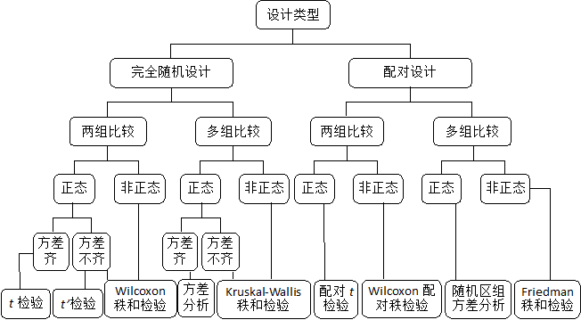
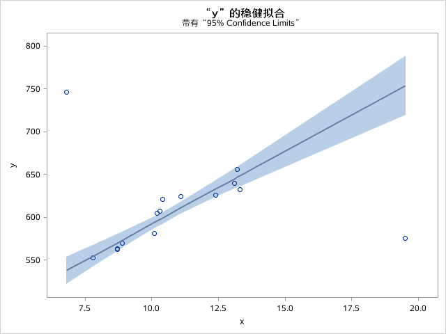

SAS学习笔记
[TOC]


# Lesson 1 数据集的建立
## 简介
**程序的基本组成**

-  **数据步**

```SAS
data 数据集名; /*新建数据集，导入储存数据*/
```
-  **过程步**

```SAS
proc 操作 <options>; /*处理数据*/
run;/*结束语*/
```
## 1 数据集的基本输入方式（数据步）

### 键盘输入INPUT

**注意事项**

- 任何语句的结束需要加一个分号“;”，必须是英文状态下的分号。

- 数据输入后，分号要另起一行，不能紧接在数据后输入。

- 输入的字母不区分大小写

- 输入格式不要求必须左对齐或右对齐

- 初学者尽量不要把多个语句放在一行。如：
   ```Input id age;  cards; 1 23; ```

   初学者最好不要用这种输入方式

- SAS数据集名或变量名太长时，可加下划线，如:
    Data drinking_in_beijing;       Input test_score;

- 程序第二句中的数字加.（如，3.）表示定义变量的宽度。

- $和&符号在 INPUT 语句中的作用：
    - $用于定义字符变量。
    - &把带有空格的值赋给变量。(两个变量之间的空格至少2个)


**具体实例**

- 列输入

```sas
data da1;
input number $ 1-3 sex $ 4 age 5-6 height 7-9 weight 10-11;
cards;
1-1f1816458
1-2m1718070
1-3m1817472
1-4.1916865
1-5m1817674
1-6f1716560
;
proc print;
run;
```

| Obs  | number | sex  | age  | height | weight |
| ---- | ------ | ---- | ---- | ------ | ------ |
| 1    | 1-1    | f    | 18   | 164    | 58     |
| 2    | 1-2    | m    | 17   | 180    | 70     |
| 3    | 1-3    | m    | 18   | 174    | 72     |
| 4    | 1-4    |      | 19   | 168    | 65     |
| 5    | 1-5    | m    | 18   | 176    | 74     |
| 6    | 1-6    | f    | 17   | 165    | 60     |

- 列表输入

```sas
data ma.fsh;                     /*数据集起名为ma.fsh，ma是逻辑库名，fsh是ma中的某一数据集名*/
input age weight height;         /*数据集中输入3个变量，命名为age、weight、height*/
cards;                           /*标志着后面就是数据输入；或者用 dataline */
26 62 171
28 58 166
;
```


- 格式输入
```sas
data da3;
input number $ 3. sex $ 2. age 3. height 4. weight 3.;
cards;
1-1 f 18 164 58
1-2 m 17 180 70
1-3 m 18 174 72
1-4 . 19 168 65
1-5 m 18 176 74
1-6 f 17 165 60
;
proc print;
run;
```
- 其他方式：
```sas
data score;
input (score1-score5) (4.);/*每个变量的取值宽度均为4*/
cards;
11112222333344445555
66667777888899991000
21113111411151116111
71118111911110111101
;
proc print;
run;

data inpab;
input (a b) ($, 5.);/*统一格式*/
cards;
11111 22222
22222 33333
33333 44444
44444 55555
;

data inpsco;
input (name score1-score5) ($10., 5*4.);/*表示字符变量NAME从第一列到第10列读取，然后从第十一列开始读取剩余的五个变量，每个变量的宽度为4；下列数据每条的长度为30*/
cards;
aaaaaaaaaa11112222333344445555
aaaaaaaaaa11112222333344445555
aaaaaaaaaa11112222333344445555
;
```


**高级INPUT语句**

- 列指针控制（@）

```sas
data inpcp;
input @15sales 5.;/*把列指针移到十五列*/
cards;
aaaaaaaaaa111192222333344445555
aaaaaaaaaa111192222333344445555
aaaaaaaaaa111192222333344445555
;
data inpcpc;
a=25;
input @a name $ 10.;/*把指针移到第25列*/
cards;
aaaaaaaaaa11119222233334b444555555
aaaaaaaaaa11119222233334b444555555
aaaaaaaaaa11119222233334b444555555
;
data inpcpb;
b=10;
input @(b*3) grade 2.;/*表示把指针移到第三十列*/
cards;
aaaaaaaaaa11119222233334b4445855555
aaaaaaaaaa11119222233334b4445855555
aaaaaaaaaa11119222233334b4445855555
;
proc print;
run;

data inpn;
input @11 length 4. +5 width;
cards;
aaaaaaaaaa11119222288888888
aaaaaaaaaa11119222288888888
aaaaaaaaaa11119222288888888
;
```

- 行指针

  ```#```指定行

   / 把指针移到下一行的第一列

  @@ 多次执行而固定一个数据输入行，在每一个数据行种含有多个观测时极为有用

```sas
data inpr;
input @2 name $ 10. #2 id 3-4;/*把指针移到第二列，从第二列到到第十一列读
字符变量NAME的值，然后把指针移到第二行从第三到第四列读ID值*/
cards;
1Ma111192222888888888888888
aa1201aaaaaaaa9222288888888
;

data inprab;
input a/b #1 @52 c #2;/*从第一行读A，从下一行读B，然后把指针移回到第一行的
第52列读C变量，在把指针移到第2行*/
cards;
241
20 88888888888888888888888888888888888888888888888777
38 999999999999999999999999999999999999
;

data inprsco;
input age grade/score1-score5;/*从第一行读AGE GRADE，然后从第二行读
SCROE1-SCROE5*/
cards;
20 2 88
38 9 2 2 2
;

/*为 DATA 步的多次执行而固定一个数据输入行。在每一个数据行中含有多个观测时极为
有用。*/
DATA AD3;
INPUT NAME $ AGE@@;
CARDS;
John 13 Mary 12 Sue 15 Tou 10
;
```


### 引用外部数据

文件--导入数据

## 2 数据变量类型

SAS中的变量只有两种类型：字符型（character）和数值型（numeric）。

日期是被看作是数值型，所有日期型变量被作为是输入日期与1960年1月1日之差。如1980-1-1， SAS会认为这个值是7305。

不同类型的变量在input语句输入时需要指定相应的格式

### 1 字符型character

```sas
data fh;
input gender$;    
/*$表示gender变量是个字符型,字符型变量一定要在变量后面加一个$符号，变量和$之间加不加空格均可。*/
cards;
female
male
;
```

### 2 数值型numeric

包括数值与日期

- 数值

如果你想让SAS有选择地读取你的数值，可以在变量后加上w.d的格式。其中，w表示数值的位数（包括小数点），如2.3的位数是3；d表示数值的小数点位数。

```sas
data fh;
input x 4.2;      /*变量后的4.2表示变量x的宽度共4位，其中小数点2位*/
cards;
12
2.1
15.6
23.46
;
proc print;
run;
```

- 日期

| SAS日期格式 | 举例      | SAS日期格式 | 举例       |
| ----------- | --------- | ----------- | ---------- |
| DDMMYY6.    | 280713    | DDMMYY8.    | 28/07/13   |
| MMDDYY6.    | 072813    | MMDDYY8.    | 07/28/13   |
| YYMMDD6.    | 130728    | YYMMDD8.    | 13/07/28   |
| DDMMYY8.    | 28072013  | DDMMYY10.   | 28/07/2013 |
| MMDDYY8.    | 07282013  | MMDDYY10.   | 07/28/2013 |
| YYMMDD8.    | 20130728  | YYMMDD10.   | 2013/07/28 |
| DATE7.      | 28JUL13   | MONYY5.     | JUL13      |
| DATE9.      | 28JUL2013 | MONYY7.     | JUL2013    |


## 3 变量输入和输出格式

**输入格式是给SAS读的，输出是给使用者读的。**

| 变量类型       | 输入格式 | 输出格式 |
| -------------- | -------- | -------- |
| 数值型非日期型 |          |          |
| 数值型日期型   |          |          |
| 字符型         |          |          |


- 1 输入格式

见上述。使用**input**或**input搭配informat**。不想改变输入值，不要在输入格式中定义宽度。

```sas
data test;
/*使用input*/
input date yymmdd10.;
/*使用input+informat*/
input date;
informat date yymmdd10.;
```
- 2 输出格式

大致同输入格式。在data步，在input语句与cards之间使用**format**。

```sas
data test;
input x;
format yymmdd10.;
cards;
20100101
20111103
;
```

### 字符型

完整的格式应该是$ < w. >。

必须在变量名后加"$"；w表示字节数（1个中文占2个字节）。

| 输入格式                           | 输出格式       |
| ---------------------------------- | -------------- |
| $ < w. >                           | $ < w. >       |
| 默认只读取前8位，超出8位必加上“w.” | 不限制输出位数 |

```sas
data city;
input city$ code$;
format city $4. code $2.; /*city的输出格式为字符型且字节数为4；code的输出格式为字符型且字节数为2*/
cards;
北京市 110000
天津市 120000
上海市 310000
;
proc print;
run;
```
结果为：
| Obs  | city | code |
| ---- | ---- | ---- |
| 1    | 北京 | 11   |
| 2    | 天津 | 12   |
| 3    | 上海 | 31   |

### 数值型

| 输入格式 | 输出格式   |含义|
| -------- | ---------- |---|
| w.d      | w.d        |总位数w，其中小数点后位数d（小数点算1bit）|
|          | commaw.d   |+ 整数部分加逗号（逗号算1bit）|
|          | percentw.d |+ 百分数形式（%算3bit）|

**w.d**的理解：

- w是指数值从左到右读取的位数，**包括小数点、逗号**！
- d是指小数点后的位数！
- **整数若不带有小数点，则在读取时被认为小数部分。**

**comma**w.d 可将数值的整数部分自右向左每三位用逗号隔开，当数值位数较多时，这是比较标准的表示方式。

```sas
data wt;
input num cost;
format num 5.2 cost comma12.1; /*num共5位其中2位小数；cost共12位其中1位小数，且用逗号每3位分隔*/
cards;
50 10205600
45 9580000
;
proc print;
run;
```

例如，输出格式为**comma7.1**时。

| 输入 | 输出  |
| ---- | ----- |
| 111  | 111.0 |
|1111|1,111.0|
|11111|11111.0|
|111111|111111|
|1111111|1111111|
|11111111|1.111E7|

### 日期型

日期有两种类型：数字、日期格式。

| 输入格式 | 输出格式 |
| -------- | -------- |
| 日期格式 | 日期格式 |
|          | 分隔符   |

日期型变量输入格式与输出格式大致相同，但**输出格式允许**在宽度值前加一个字母，表示日期的分隔符号。**但不能用于date7.或date9.等格式。**

**日期格式**

| 日期格式  | 举例      | 日期格式  | 举例       |
| -------- | --------- | --------- | ---------- |
| DDMMYY6. | 280713    | DDMMYY8.  | 28/07/13   |
| MMDDYY6. | 072813    | MMDDYY8.  | 07/28/13   |
| YYMMDD6. | 130728    | YYMMDD8.  | 13/07/28   |
| DDMMYY8. | 28072013  | DDMMYY10. | 28/07/2013 |
| MMDDYY8. | 07282013  | MMDDYY10. | 07/28/2013 |
| YYMMDD8. | 20130728  | YYMMDD10. | 2013/07/28 |
| **DATE7.** | 28JUL13   | **MONYY5.** | JUL13      |
| **DATE9.** | 28JUL2013 | **MONYY7.** | JUL2013    |

**分隔符号**

| 字母 | 含义 |日期输出格式 | 结果显示 |
| ---- | ---- |------------ | -------- |
|s|slash(/)|YYMMDDs8.    | 13/07/28 |
|d|dash(-)|YYMMDDd8.    | 13-07-28 |
|p|point(.)| YYMMDDp8.    | 13.07.28 |
|c|colon(:)|YYMMDDc8.    | 13:07:28 |
|b|blank( )|YYMMDDb8.    | 13 07 28 |
|n|nothing()|YYMMDDn8.    | 20130728 |

### 自定义输入和输出格式：proc  format

- 自定义值的内容的输入与输出格式 **invalue 与 value**

invalue 输入看“**原值**”

value 输出看“**新值**”

```sas
proc format;
invalue <$> variable_name range/value = self-defined value.../*自定义输入格式*/
value <$> variable_name range/value = self-defined value.../*自定义输出格式*/
picture module_name < range >;
```

|  | 原值   | 新值   | 语句 |
| --------- | ------ | ------ | ---- |
| 输入      | 字符型 | **数值型** |invalue grade "a"-"g"=1 other=2|
| 输入      | 字符型 | **字符型** |invalue **$grade** "a"-"g"="fair"  "o","u"="other"|
| 输入      | 数值型 | **数值型** |invalue lxfmt 1-4=_same_ 99=.;      1-4则保持不变，99则改为缺失值|
| 输入      | 数值型 | **字符型** |invalue **$gender** 1="male" 2="female" |

|  | 原值   | 新值   | 语句 |
| --------- | ------ | ------ | ---- |
| 输出      | **字符型** | 字符型|value **$grade** "a"-"g"="fair"      |
|输出|**字符型**|数值型|value **$grade** "a"-"g"="fair"  "o","u"="other"|
|输出|**数值型**|字符型||
|输出|**数值型**|数值型||

- 自定义值的形式的格式 **picture**

```sas
picture 格式名 原值=新格式(prefix="￥");/*prefix表示加前缀*/

proc format;
/*对所有数值，定义格式要求：前缀为￥，每满三位数加逗号“,”*/
picture gs1 low-high="0,000,000"(prefix="￥");
/**/
picture gs2 low-high="09.99%";
run;
data profit;
input profit prop;
format profit gs1. prop gs2.;
cards;
298000 16.72
458992 21.30
;
proc print;
run;

```

结果为：

| Obs  | profit    | prop   |
| ---- | --------- | ------ |
| 1    | ￥298,000 | 16.72% |
| 2    | ￥458,992 | 21.30% |

说明一下，"09.99%"的理解是：

1. 先对齐小数点；
2. 再根据小数点前多少位数就保留多少位数
3. 整数部分从个位开始，小数点前多少位就保留多少位数
4. 倘若不只有一个小数点，那么先对齐最末尾的小数点；
5. 末尾加上符号（**不是把原值改为等值的百分数形式！！无论是什么符号都可以！！**）

## 4 特殊变量的输入

### 给定宽度，是否取空格为字符

```sas
data test;
input id$8. gender$1. city$7.;
cards;
12345678 m beijing
;
proc print;
run;
```

所得结果为：

|obs| id       | gender | city    |
|---| -------- | ------ | ------- |
|1| 12345678 |        | m beiji |

原因是**指定宽度后，空格也成为字符的一部分**。修改方式如下：

- 需要指定多个变量的宽度
  - 改变输入格式中的宽度
    ```sas
    input id$9. gender$2. city$7.
    ```

  - 改变变量的读取位置（+1表示往后1个字符读取）

    ```sas
    input id$8.+1 gender$1.+1 city$7.;
    ```

  - 利用**冒号（:）**来正确读取（冒号表示**识别前后的空格是分隔符号**，不作为字符内容；否则空格也是字符的一部分）

    冒号（:）的作用是告诉SAS，如果要读取下一个数据，需要满足下面任一条件：
    - 遇到空格；
    - 指定的变量宽度已满；
    - 数据行结束。

    ```sas
    input id:$8. gender:$1. city:$7.;
    ```

- 数据集中有空格

  **&**读取 **空格**作为字符的一部分，而**<u>多个空格则作为分隔符</u>**

  （变量名后加 “**&**”。同时cards后的不同变量之间需要**至少2个**空格。）

  ```sas
  data fh;
  input name&:$50. city&:$50.; /*变量名后加 $ */
  cards;
  Peter Parker  山东省 蓬莱市  /*两个变量之间至少2个空格*/
  Ross Geller  山东省 青岛市 市南区  
  ;
  proc print;
  run;
  ```

### 数据集中有**缺失值**

  缺失值用 “**.** ”表示。

  ```sas
  data fh;
  input id day: yymmdd8. city:$20.; 
  format day yymmddp10.;  
  cards;
  37 980515 .
  . 120607 shanghai
  39 . nanjing
  ;
  proc print;
  run;
  ```

  结果为
|obs|id|day|city|
|--|--|--|--|
|1|37|1998.05.15||
|2|.|2012.06.07|shanghai|
|3|39|.|nanjing|

### 有规律的变量

  用do循环输入数据

  ```sas
  data test;
  do count=3 to 9 by 2；
  <语句>
  end；
  run；
  ```

  其中的语句若使用input，则必须加上output。

  例如1-12月是连续加1的规律。

  未使用do循环时：

  ```sas
  data test;
  input count time;
  cards;
  1 23
  2 29
  3 49
  4 64
  5 87
  6 96
  ;
  proc print;
  run;
  ```

  由于count具有加1的规律，使用do循环后：

  ```sas
  data test;
  do count=1 to 6; /*使用do循环输入count的值*/
  input time;
  output; /*必须*/
  end; /*必须*/
  cards; /*省略count的输入*/
  23
  29
  49
  64
  87
  96
  ;
  proc print;
  run;
  ```

### 是否换行输入

  用@符号

  - @@与@符号的区别：

    - @@强制保持当前记录，不管data步中有没有其他语句
    - @如果data步中没有其他语句，就hold不住当前记录，仍然转到下一记录，如果有第二个input语句，就可以hold住当前记录，等待第二个input顺序读取

  - **@@** 强行保持当前行。所输入数据均作为**某一变量**的值

    - CASE 1——录入单一变量

    ```sas
    data test;
    input weigh@@;
    cards;
    1 2 3 
    4 5 6
    ;
    proc print;
    run;
    ```

    ​	结果为：

    | Obs  | weigh |
    | ---- | ----- |
    | 1    | 1     |
    | 2    | 2     |
    | 3    | 3     |
    | 4    | 4     |
    | 5    | 5     |
    | 6    | 6     |

    

    - CASE 2——输入列联表

    | |吸烟（1）|不吸烟（2）|
    | ---- | ---- | ---- |
    | 男（1）     |100      |150      |
    |女（2）|10|140|

    ```sas
    /*常规输入*/
    data a;
    input gender smoking;
    cards; /*每一行表示一个个案的资料*/
    1 2
    2 1
    1 1
    1 1
    ...
    ;
    proc print;
    run;
    /*用@@输入*/
    data a;
    do gender= 1 to 2;
    do smoking= 1 to 2; /*先进行小循环，后进行大循环*/
    input x@@; /*x为频数*/
    output;
    end;
    end;
    cards;
    100 150
    10 140
    ;
    run;
    ```

    ​	结果：

    | Obs  | gender | smoking |
    | ---- | ------ | ------- |
    | 1    | 1      | 2       |
    | 2    | 2      | 1       |
    | 3    | 1      | 1       |
    | 4    | 1      | 1       |

    

  - **@** 保持当前行

    ```SAS
    data test;
    /*<几种不同的input方式>;*/
    cards;
    1 2 3 4
    5 6 7 8
    ;
    proc print;
    run;
    
    /*1*/
    input x@@;
    /*2*/
    input x;
    input y;
    /*3*/
    input x@;
    input y;
    /*4*/
    input x y;
    ```

    结果分别为：

    <1>通过@@强制将所有数据录入为值

    | Obs  | x    |
    | ---- | ---- |
    | 1    | 1    |
    | 2    | 2    |
    | 3    | 3    |
    | 4    | 4    |
    | 5    | 5    |
    | 6    | 6    |
    | 7    | 7    |
    | 8    | 8    |

     <2>x与y分别在两行，各取一个值

    ```sas
    /*2*/
    input x;
    input y;
    ```

    | Obs  | x    | y    |
    | ---- | ---- | ---- |
    | 1    | 1    | 5    |

     <3>通过@保留原排列并认为第一、二列分别是x、y变量

    ```sas
    /*3*/
    input x@;
    input y;
    ```

    | Obs  | x    | y    |
    | ---- | ---- | ---- |
    | 1    | 1    | 2    |
    | 2    | 5    | 6    |

     <4>第一、二列分别是x、y变量

    ```sas
    /*4*/
    input x y;
    ```

    | Obs  | x    | y    |
    | ---- | ---- | ---- |
    | 1    | 1    | 2    |
    | 2    | 5    | 6    |

#### 输入重复测量数据

    ```sas
    /*常规输入*/
    data test1;
    input id time score;
    cards;
    1 1 86
    1 2 89
    1 3 90
    2 1 89
    2 2 87
    2 3 91
    ...
    ;
    proc print;
    run;
    /*利用@符号输入*/
    data test2;
    input id@;
    do time= 1 to 3; /*对于每个id，都有time从1到3取值*/
    input score@@; /*对于每个id与time的组合，都有一个score相对应*/
    output;
    end;
    cards;
    1 86 89 90
    2 89 87 91
    ...
    ;
    proc print;
    run;
    ```


### 产生新变量
```sas
新变量 = 表达式 或者 函数
```
|算术运算符|比较运算符|逻辑运算符|
|--|--|--|
|+ （加）|=（等于）、 ^=（不等于）|&或and（表示2个表达式同时成立）|
|- （减）|>（大于）、 <（小于）| \|或or（表示2个表达式任一成立） |
|* （乘）|>=（大于等于）、 <=（小于等于）||
|/ （除）| in(范围)（属于其中）grade in(2,4,6)表示只要是grade为2、4、6中的其中一个就算符合条件 ||
|**          （幂次方）|dept not in(“A”, “B”)表示只要dept不是“A”或“B”就算成立||

#### 宽度限制

产生新变量前，对其进行宽度限定，使用length

```sas
data bonus;
input id g1 g2 bonus;
length g $6.;  /*定义字符变量g的长度为6，若无该语句，则宽度受第一个值的影响*/
if g1>=70 and g2>=70 then g="合格";
else g="不合格";
if g="合格" then bonus=bonus*1;
else bonus=bonus*0.5;
cards;
1 67 74 10000
2 80 85 11000
3 89 87 11000
4 78 69 10000
;
proc print;
run;
```

无length语句：

| Obs  | id   | g1   | g2   | bonus | g    |
| ---- | ---- | ---- | ---- | ----- | ---- |
| 1    | 1    | 67   | 74   | 5000  | 不合 |
| 2    | 2    | 80   | 85   | 11000 | 合格 |
| 3    | 3    | 89   | 87   | 11000 | 合格 |
| 4    | 4    | 78   | 69   | 5000  | 不合 |

有length语句：

| Obs  | id   | g1   | g2   | bonus | g      |
| ---- | ---- | ---- | ---- | ----- | ------ |
| 1    | 1    | 67   | 74   | 5000  | 不合格 |
| 2    | 2    | 80   | 85   | 11000 | 合格   |
| 3    | 3    | 89   | 87   | 11000 | 合格   |
| 4    | 4    | 78   | 69   | 5000  | 不合格 |


## 5 数据集的导入和导出

## 6 建立和调用永久性数据集

SAS数据都是存放在资源管理器的逻辑库中。逻辑库中有SAS自带的6个文件夹，用来存放不同类型的数据。
理论上，我们在用data语句起名字时，还需要告诉SAS建立的数据集是放在哪个文件夹里。如，data sasuser.fh;表示建立数据集fh，放在sasuser这个文件夹，再如data work.fh;表示建立数据集fh，放在work这个文件夹。
SAS默认，如果data语句中没有加文件夹名字，就是**默认为存放到临时文件夹work**中，也就是说，data fh;与data work.fh;是完全等同的。当关闭sas时work内的数据集将清空。

### 建立永久性数据集

相当于把建立的数据集存放到硬盘的一个文件夹中。具体主要包括三个步骤：

- 在电脑硬盘建立一个文件夹，准备用来存放数据集；
- 在SAS的资源管理器中也新建一个文件夹，起个自己喜欢的英文名字；
- 把这两个文件夹关联起来。

**方式一：菜单中新建**
[1]在本地硬盘建立一个文件夹作为数据集存放处（假设路径为g盘目录下的mysasfile文件夹）
[2]逻辑库处右键新建新库并命名（假设是mydir），路径浏览选择上述文件夹
[3]编辑器处添加数据集

```sas
data mydir.test; /*在mydir库中添加名为test的新数据集*/
input id day: yymmdd8. city:$20.;    
format day yymmddp10.;  
cards;
370685 980515 shandong
;
run; /*运行后，在g盘目录下的mysasfile文件夹中会出现test数据集*/
```
**方式二：编辑器中新建，并与逻辑库关联**
[1]同上
[2]编辑器中新建新库，并添加数据集

```sas
libname mydir "g:\mysasfile"; /*新建名为mydir的新库，并与路径中的文件夹相关联*/
data mydir.test; /*在mydir库中添加名为test的新数据集*/
input id day: yymmdd8. city:$20.;    
format day yymmddp10.;  
cards;
370685 980515 shandong
;
run; /*运行后，在g盘目录下的mysasfile文件夹中会出现test数据集*/
```

**方式三：编辑器中新建**

```sas
data "g:\mysasfile\first";/*在g:\mysasfile\中新建一个名为first的数据集*/
input id day: yymmdd8. city:$20.;    
format day yymmddp10.;  
cards;
370685 980515 shandong
;
run;
```

### 调用永久性数据集

调用硬盘上的SAS数据集
[1]首先要知道硬盘上的文件夹位置及名称
[2]]利用libname语句读取相应位置的文件夹中的文件

```sas
libname mydir "g:\mysasfile"; 
proc print data= mydir.test;
run;
```


# Lesson 2 数据集的管理

## 1 纵向合并与横向合并

|纵向合并|横向合并|
|--|--|
|增加个案数|增加变量数|
|set|merge|
|纵向合并可能需要考虑个案的来源|横向合并可能需要考虑到：索引变量匹配、存在缺失变量时筛选变量齐全的个案|

- 纵向合并

```SAS
data s1;
input id gender age;
cards;
1 1 12
2 1 24
3 2 13
;
proc print;
run;
data s2;
input id gender age;
cards;
4 1 15
5 2 22
6 1 20
;
proc print;
run;
data s;
set s1(in= a1) s2(in=a2); /*set将s1与s2纵向合并，即增加个案数；数据集选项in=a1表示对于s1数据集的a1参数为1，同理s2数据集的a2参数为1，标记数据来源 */
by id; /*by表示排序依据，默认为升序，在变量前加descending表示降序*/
c1=a1; /*a1为临时变量，故将其赋值到c1中*/
c2=a2; 
proc print;
run;
```

s1

| Obs  | id   | gender | age  |
| ---- | ---- | ------ | ---- |
| 1    | 1    | 1      | 12   |
| 2    | 2    | 1      | 24   |
| 3    | 3    | 2      | 13   |

s2 

| Obs  | id   | gender | age  |
| ---- | ---- | ------ | ---- |
| 1    | 4    | 1      | 15   |
| 2    | 5    | 2      | 22   |
| 3    | 6    | 1      | 20   |

s

| Obs  | id   | gender | age  | c1   | c2   |
| ---- | ---- | ------ | ---- | ---- | ---- |
| 1    | 1    | 1      | 12   | 1    | 0    |
| 2    | 2    | 1      | 24   | 1    | 0    |
| 3    | 3    | 2      | 13   | 1    | 0    |
| 4    | 4    | 1      | 15   | 0    | 1    |
| 5    | 5    | 2      | 22   | 0    | 1    |
| 6    | 6    | 1      | 20   | 0    | 1    |

- 横向合并

```sas
data m1;
input id gender;
cards;
1 1
2 1
3 2
4 1
5 2
6 1
;
data m2;
input id age;
cards;
1 12
2 24
3 13
4 15
5 22
6 20
data m;
merge m1(in=a1) m2(in=a2);
by id; /*by表示索引变量为id*/
c1=a1; 
c2=a2;
if c1=1 and c2=1; /*if条件语句用于判断个案是否包含来自m1和m2的数据，从而筛选保留数据来源齐全的个案*/
proc print;
run;
```

m1 

| Obs  | id   | gender |
| ---- | ---- | ------ |
| 1    | 1    | 1      |
| 2    | 2    | 1      |
| 3    | 3    | 2      |
| 4    | 4    | 1      |
| 5    | 5    | 2      |
| 6    | 6    | 1      |

m2

| Obs  | id   | age  |
| ---- | ---- | ---- |
| 1    | 1    | 12   |
| 2    | 2    | 24   |
| 3    | 3    | 13   |
| 4    | 4    | 15   |
| 5    | 5    | 22   |
| 6    | 6    | 20   |

m

| Obs  | id   | gender | age  | c1   | c2   |
| ---- | ---- | ------ | ---- | ---- | ---- |
| 1    | 1    | 1      | 12   | 1    | 1    |
| 2    | 2    | 1      | 24   | 1    | 1    |
| 3    | 3    | 2      | 13   | 1    | 1    |
| 4    | 4    | 1      | 15   | 1    | 1    |
| 5    | 5    | 2      | 22   | 1    | 1    |
| 6    | 6    | 1      | 20   | 1    | 1    |

- 延伸：
1-  1if语句筛选后删除符合条件的个案

```sas
if <条件（表达式）> then delete;
```

- where 也可作为**数据集选项**

```sas
input m1(where= a1);
```


## 2 拆分为若干个子集

### 对观测个案的选择 if/where  firstobs/obs

#### (1) 条件：if语句、where （选项 或者 语句）

```sas
/*if语句的写法*/
if 表达式 then 表达式;
else 表达式;
/*if语句的另一种写法*/
if 表达式;
/*where语句的写法*/
set cf0;
where gender="m" and age>40;
/*where选项*/
set cf0(where=(gender="m" and age>40));
```


```sas
data cf0;
input id gender$ age;
cards;
1 f 21
2 m 15
3 f 34
4 f 25
5 m 42
6 m 50
;
data cf1;
<条件语句>
proc print ;
run;

/*第一种：if语句*/
set cf0;
if gender="m" and age>40;
/*第二种：where语句*/
set cf0;
where gender="m" and age>40;
/*where选项*/
set cf0(where=(gender="m" and age>40));
```
#### (2) obs与firstobs（数据集选项）

| obs             | firstobs        |
| --------------- | --------------- |
| 末位obs（包含） | 起始obs（包含） |

```sas
/*选择观测1-5*/
data pop;
do id=1 to 10;
output;
end;
;
data sam;
set pop(obs=5);
proc print;
run;
/*选择观测3-7*/
data pop;
do id=1 to 10;
output;
end;
;
data sam;
set pop(firstobs=3 obs=7);
proc print;
run;
/*选择观测6-10*/
data pop;
do id=1 to 10;
output;
end;
;
data sam;
set pop(firstobs=6);
proc print;
run;
```

### 对变量选择 drop keep

#### **drop 与keep**（数据集选项 或者 语句）

```sas
/*用作选项*/set 数据集(drop=变量);
/*用作语句*/drop 变量;

/*用作选项*/set 数据集(keep=变量);
/*用作语句*/keep 变量;
```


```sas
/*数据ht包含8个变量*/
data ht;
input id name$ gender age date1: yymmdd9. height1 date2: yymmdd9. height2;
format date1 date2 yymmdd10.;
cards;
1 LVJI 1 15 20110401 151 20120401 155
2 LXJU 2 16 20110401 153 20120402 155
3 LYJI 2 15 20110402 160 20120403 163
4 WAJI 2 17 20110401 149 20120401 154
5 JHYU 1 16 20110402 162 20120402 166
;
/*删除变量gender*/
/*方法一*/
data ht1;
set ht;
drop gender;
proc print;
run;
/*方法二*/
data ht1x;
set ht(drop=gender);
proc print;
run;
/*保留变量id与name*/
/*方法一*/
data ht2;
set ht;
keep id name;
proc print;
run;
/*方法二*/
data ht2x;
set ht(keep=id name);
proc print;
run;
```


## 3 排序proc sort

```sas
proc sort <out= 数据集名> <nodupkey> <nouniquekey>;
by <descending> 变量1 变量2 ...;
run;
```

排序处理在过程步（proc）。proc sort语句调用排序过程。

|选项|含义|
|-------|------|
|<**out=数据集**>|指定排序后的数据集名。因为排序后数据发生了变化，因此可指定该选项将排序后的数据存放到一个新的数据集中。如果不加该选项，排序后的数据集将覆盖原有数据集，这样你就找不回原有的未排序的数据了。|
| <**nodupkey**| 表示如果by语句指定的排序变量有重复值，则**删除重复值（保留唯一值）**。如按id排序，如果id有重复值，则只保留重复值中的第一个值，删除其它值。|
|<**nouniquekey**>|跟nodupkey正好相反，用于**删除唯一值（保留重复值）**如果by语句指定的排序变量都是唯一值，则将其删除。如按id排序，如果id没有有重复值，则全部删除。|

|搭配语句|含义|
|-------|------|
|**by...                                        < descending >**|指定排序的变量，可以指定多个。**选项< descending >**表示按降序排序，如果不加该选项，默认的是按升序排序。|


### (1) 排序

```sas
/*数据集ht包含5名学生的编号、姓名、性别、年龄、身高、日期*/
data ht;
input id name$ gender age date: yymmdd9. height;
format date yymmdd10.;
cards;
1	LVJI	1	15	20110401	151
2	LXJU	2	.	20110401	153
3	LYJI	2	15	20110402	160
4	WAJI	2	17	20110401	149
5	JHYU	1	16	20110402	162
;

proc sort out=ht_height;
by date descending age;
proc print data=ht_height;
run;

```

### (2) 查找重复值
```sas
data dup;
input name$ gender age;
cards;
Tony 1 31
Sam 1 30
Frank 2 29
Larry 1 29
Frank 2 29
Sam 2 30
;
```

#### [1]仅保留不重复值 nodupkey
注意重复值中仅保留第一个个案

```sas
proc sort out=norep nodupkey;
by name;
proc print data=norep;
run;
```

#### [2]仅保留重复值 nouniquekey

```sas
proc sort out=rep nouniquekey; 
by name;
proc print data=rep;
```

## 4 转置 proc transpose

```sas
proc transpose <out=数据集> <name=第一列的变量名> <prefix=前缀名>;
by <descending> 变量1 <descending> 变量2 ……;
id 变量1 变量2 ……;
var 变量1 变量2 ……;
run;
```

proc transpose语句调用转置命令。

**注意选项name、prefix 和 id语句的用法的鉴别**


|选项|含义|
|-------|------|
|**<out=数据集>**|表示将转置后的数据输出到指定的数据集中；数据转置后，原来的变量名会变为转置后的变量值|
| **<name=变量名>** |为转置后的**第一列变量**起名，如果忽略该选项，默认名为_NAME_|
| **<prefix=前缀名>**| 表示为转置后的**第二列及以后列变量统一加前缀名**，前缀名后为1/2/3/4/... |

|搭配语句|含义|
|-------|------|
|**by语句**| 指定一个或多个变量，在每一变量内部进行转置，by语句指定的变量不进行转置。 |
|**id语句** |指定转置前数据集中的一个变量，将其值作为**转置后的第二列及以后列变量名**。省略该语句时，默认转置后的变量名依次为_NAME_、COL1、COL2、COL3、……。|

```sas
data vas;
input name$ id group vas1-vas3;  
cards;
LIXM 1 1 5 5 6
ZHMI 2 2 8 5 5
FEND 3 2 7 4 5
LIMZ 4 1 6 6 3
WAXF 5 2 6 7 5
DOCX 6 1 6 5 5
;
```

| Obs  | name | id   | group | vas1 | vas2 | vas3 |
| ---- | ---- | ---- | ----- | ---- | ---- | ---- |
| 1    | LIXM | 1    | 1     | 5    | 5    | 6    |
| 2    | ZHMI | 2    | 2     | 8    | 5    | 5    |
| 3    | FEND | 3    | 2     | 7    | 4    | 5    |
| 4    | LIMZ | 4    | 1     | 6    | 6    | 3    |
| 5    | WAXF | 5    | 2     | 6    | 7    | 5    |
| 6    | DOCX | 6    | 1     | 6    | 5    | 5    |

#### 单纯转置
```sas
proc transpose;                
proc print;
run;
```
转置后
| Obs  | _NAME_ | COL1 | COL2 | COL3 | COL4 | COL5 | COL6 |
| ---- | ------ | ---- | ---- | ---- | ---- | ---- | ---- |
| 1    | id     | 1    | 2    | 3    | 4    | 5    | 6    |
| 2    | group  | 1    | 2    | 2    | 1    | 2    | 1    |
| 3    | vas1   | 5    | 8    | 7    | 6    | 6    | 6    |
| 4    | vas2   | 5    | 5    | 4    | 6    | 7    | 5    |
| 5    | vas3   | 6    | 5    | 5    | 3    | 5    | 5    |

proc transpose**只对数值型变量转置**，不转置字符型变量；
原数据集中的变量名转置后成为变量值，命名为_NAME_；
原数据集中的每一个观测转置后都成为一个新变量，依次命名为COL1、COL2、……。


#### 加上by语句，限定某一变量不转置
```sas
proc transpose; 
by  id;
proc print;
run;
```
结果为
| Obs  | id   | _NAME_ | COL1 |
| ---- | ---- | ------ | ---- |
| 1    | 1    | group  | 1    |
| 2    | 1    | vas1   | 5    |
| 3    | 1    | vas2   | 5    |
| 4    | 1    | vas3   | 6    |
| 5    | 2    | group  | 2    |
| 6    | 2    | vas1   | 8    |
| 7    | 2    | vas2   | 5    |
| 8    | 2    | vas3   | 5    |
| 9    | 3    | group  | 2    |
| 10   | 3    | vas1   | 7    |
| 11   | 3    | vas2   | 4    |
| 12   | 3    | vas3   | 5    |
| 13   | 4    | group  | 1    |
| 14   | 4    | vas1   | 6    |
| 15   | 4    | vas2   | 6    |
| 16   | 4    | vas3   | 3    |
| 17   | 5    | group  | 2    |
| 18   | 5    | vas1   | 6    |
| 19   | 5    | vas2   | 7    |
| 20   | 5    | vas3   | 5    |
| 21   | 6    | group  | 1    |
| 22   | 6    | vas1   | 6    |
| 23   | 6    | vas2   | 5    |
| 24   | 6    | vas3   | 5    |

#### 修改列名
```sas
proc transpose data=vas name=vars; /*此处的name不是人为的变量名，而是sas本身对转置后第一列的变量名的固定称呼*/
id name; /*此处的id不是人为的变量名，而是sas本身对转置后第一行第2个及之后的值的固定称呼；此处的name是转置前的人为的变量name*/
proc print;
run;
```
结果为
| Obs  | vars  | LIXM | ZHMI | FEND | LIMZ | WAXF | DOCX |
| ---- | ----- | ---- | ---- | ---- | ---- | ---- | ---- |
| 1    | id    | 1    | 2    | 3    | 4    | 5    | 6    |
| 2    | group | 1    | 2    | 2    | 1    | 2    | 1    |
| 3    | vas1  | 5    | 8    | 7    | 6    | 6    | 6    |
| 4    | vas2  | 5    | 5    | 4    | 6    | 7    | 5    |
| 5    | vas3  | 6    | 5    | 5    | 3    | 5    | 5    |


## 5 对比多个数据集是否一致 proc compare

```sas
proc compare <base=数据集 compare=数据集> <nosummary> ;
by 变量1 变量2 ……;
```

proc compare语句调用数据比较过程。

|选项|含义|
|-------|------|
|base|指定比较的数据集|
|compare|指定被比较的数据集|
|nosummary|作用是不显示一些概括性的结果|

|搭配语句|含义|
|-------|------|
|by|指定的变量有点类似于**“索引”**的作用，通常指定id号。如果两个数据集的观测数不同，利用by语句可以保证它们比较的仍然是同一个id号，而不会出现错位比较的情况|

```sas
data a1;
input id gender age height weight;
cards;
1 2 24 165 55
2 2 24 160 48
3 2 28 160 60
4 2 27 155 48
5 2 25 165 59
;
data a2;
input id gender age height weight;
cards;
1 2 24 165 55
2 2 24 160 48
3 2 25 162 60
4 2 27 155 48
5 2 25 162 59
;
proc compare base=a1 compare=a2 nosummary;
run;
```

结果为：

```sas
                                           COMPARE 过程
                                      比较 WORK.A1 与 WORK.A2
                                          (METHOD=EXACT)

NOTE: 下列 2 个变量的值经比较不相等: age height


                                          变量的值比较结果

                    __________________________________________________________
                               ||       基准       比较
                          观测 ||        age        age       差异    差异(%)
                     ________  ||  _________  _________  _________  _________
                               ||
                            3  ||    28.0000    25.0000    -3.0000   -10.7143
                    __________________________________________________________


                    __________________________________________________________
                               ||       基准       比较
                          观测 ||     height     height       差异    差异(%)
                     ________  ||  _________  _________  _________  _________
                               ||
                            3  ||   160.0000   162.0000     2.0000     1.2500
                            5  ||   165.0000   162.0000    -3.0000    -1.8182
                    __________________________________________________________
```


## 6 修饰

#### 对变量名的注释

```sas
label 变量1= 标签1 变量2=标签2 ...;
```

#### 对变量的值的注释

```sas
/*制定自定义格式*/
proc format;
invalue <$>格式名 变量或范围1=输入格式1 ...;
value <$>格式名 变量或范围1=输入格式1 ...;
--------
/*应用自定义的格式*/
format 变量 <$>格式名.; /*自定义的格式名需要在末尾加英文句号*/
```

| invalue                                                      | value                             |
| ------------------------------------------------------------ | --------------------------------- |
| 输入格式                                                     | 输出格式                          |
| 若invalue的目标数据是字符型，则无论数据本身是数值或是字符都作为字符输入 | 若源数据是字符，则需要在变量名前加$ |

```sas
proc format;
value first 1-2="male" 3="female";
value $second "a"-"g"="fair" "o","u"="other";
data test;
input x y$;
format x first.;
format y second.; /*两个变量分开两行设定格式*/
cards;
1 a
2 b
1 o
2 u
3 g
1 i
;
proc print;
run;
```

原本数据

| Obs  | x    | y    |
| ---- | ---- | ---- |
| 1    | 1    | a    |
| 2    | 2    | b    |
| 3    | 1    | o    |
| 4    | 2    | u    |
| 5    | 3    | g    |
| 6    | 1    | i    |

修饰结果

| Obs  | x      | y     |
| ---- | ------ | ----- |
| 1    | male   | fair  |
| 2    | male   | fair  |
| 3    | male   | other |
| 4    | male   | other |
| 5    | female | fair  |
| 6    | male   | i     |


## 7 输出样式  proc print

```sas
proc print <data=> <label> <noobs> ;
by <descending> 变量1 <descending> 变量2 …;
var变量1 变量2 … < style >;
sum 变量1 变量2 … < style >;
```

proc print调用输出过程。

|选项|含义|
|-------|------|
|< data= >|指定要输出的数据集，如果不指定，默认为最近一次使用的数据集|
|< label >|要求显示用label语句指定的变量标签。前提在data步已有label语句。|
|< noobs >|要求不显示最左侧的obs列。|

|搭配语句|含义|
|-------|------|
|by|**分组**：将数据集按指定的变量分开显示。使用by语句之前，最好先用proc sort排一下序|
|var|**指定**需要**输出**的变量，如果不写，默认为全部输出|
|sum|给出指定数值变量的求和。这四个语句中的style选项均同proc print语句|

```sas
data baseline;
input id gender$ age height weight; 
label gender="性别"; 
cards;
1 female 36 160 60
2 female 43 168 56
3 male 51 171 73
4 female 60 160 50
5 male 66 172 55
;
proc print;
```
原本数据：

| Obs  | id   | gender | age  | height | weight |
| ---- | ---- | ------ | ---- | ------ | ------ |
| 1    | 1    | female | 36   | 160    | 60     |
| 2    | 2    | female | 43   | 168    | 56     |
| 3    | 3    | male   | 51   | 171    | 73     |
| 4    | 4    | female | 60   | 160    | 50     |
| 5    | 5    | male   | 66   | 172    | 55     |


输出修饰：
```sas
proc sort; 
by gender;
proc print data=baseline noobs label; 
by gender; sum height weight; 
run;
```

结果为：

性别=female

| id     | age  | height | weight |
| ------ | ---- | ------ | ------ |
| 1      | 36   | 160    | 60     |
| 2      | 43   | 168    | 56     |
| 4      | 60   | 160    | 50     |
| gender |      | 488    | 166    |

性别=male

| id     | age  | height | weight |
| ------ | ---- | ------ | ------ |
| 3      | 51   | 171    | 73     |
| 5      | 66   | 172    | 55     |
| gender |      | 343    | 128    |
|        |      | 831    | 294    |


# Lesson 3 SAS实用函数


## （1）与数值有关的函数

### 数值运算

| 函数     | 用途                    |
| -------- | ----------------------- |
| mod(x,y) | 返回x除以y的余数        |
| abs(x)   | 返回x的绝对值           |
| exp(x)   | 返回x的指数值           |
| log(x)   | 返回x的自然对数值       |
| log10(x) | 返回x的以10为底的对数值 |
| sqrt(x)  | 返回x的平方根           |


### 数值舍入

| 函数     | 用途             |
| -------- | ---------------- |
| ceil(x)  | 返回≥x的最小整数 |
| floor(x) | 返回≤x的最大整数 |
| int(x)   | 返回x的整数部分  |

## （2）与统计有关的函数

### 统计描述

| 函数    | 用途                 | 函数     | 用途         |
| ------- | -------------------- | -------- | ------------ |
| n       | 求例数（不含缺失值） | sum      | 求和         |
| nmiss   | 求缺失例数           | stderr   | 求标准误     |
| mean    | 求均数               | min      | 求最小值     |
| median  | 求中位数             | max      | 求最大值     |
| geomean | 求几何均数           | smallest | 求第几小的值 |
| std     | 求标准差             | largest  | 求第几大的值 |
| range   | 求全距               | pctl     | 求百分位数   |
| iqr     | 求四分位数间距       |          |              |
|         |                      |          |              |

#### 函数表达形式

- 第一类：<u>**函数smallest、largest、pctl**</u>：**函数(k,x1,x2,x3,…xn) 或 函数(k,of x1-xn)**
  其中，k表示第k小（smallest）、第k大（largest）或第k%的值（pctl）

```sas
/*从小到大排序，第k个*/
smallest(k,x1,x2,x3);
smallest(k,of x1-x3);
/*从大到小排序，第k个*/
largest(k,x1,x2,x3);
smallest(k,of x1-x3);
/*第k%的值*/
pctl(k,of x1-x3);
pctl(k,x1,x2,x3);
```

- 第二类：除上述3种函数以外，其余函数的基本用法都是相同的，通常可以写成两种方式：
  **函数(x1,x2,x3,…xn) 或 函数(of x1-xn)**

#### 统计描述函数与算数函数的用法区别：

统计描述函数的计算功能可以由算术函数完成：

```sas
a=mean(of x1-x5);
b=(x1+x2+x3+x4+x5)/5;
```

**统计描述函数**是针对**每个观测的多个变量**进行计算的，而不是针对**某个变量的多个观测**进行计算。（**即计算行的平均值）**
如果想用这些函数求某一变量的多个观测的统计描述指标，可以先利用**proc transpose**将数据转置，然后再用函数求出。

**proc means**可以计算**每个变量的多个观测**的均值。**（即计算列的平均值）**


## （3）与字符有关的函数

### 字符转换  input 与 put

| 函数                  | 变量类型要求                                                 | 作用                                                         |
| --------------------- | ------------------------------------------------------------ | ------------------------------------------------------------ |
| input(变量,输入格式); | 变量必须为字符变量。                                         | 除可以将字符型转为数值型外，也可以将字符型转为其它格式的字符型。 |
| put(变量,输出格式);   | 变量可以是字符变量，也可以是数值变量。但它的输出的一定是个字符变量。 | 将数值型变量转换为字符型，也可以将字符变量转换为自己定义的其它格式的字符变量。 |

```sas
/*将看似日期格式的字符型变量转换为真正的日期型变量。
假定有如下数据集，三个变量均为字符型*/
data char;
input sn:$10. d1:$10. d2:$10.;
newd1=input(d1,yymmdd8.);
newd2=input(d2,date9.);
cards;
123 20091012 21oct1999
1235 20130325 06apr2009
;
proc contents;
run;
```

结果为：

| 按字母排序的变量和属性列表 |       |      |      |
| -------------------------- | ----- | ---- | ---- |
| #                          | 变量  | 类型 | 长度 |
| 2                          | d1    | 字符 | 10   |
| 3                          | d2    | 字符 | 10   |
| 4                          | newd1 | 数值 | 8    |
| 5                          | newd2 | 数值 | 8    |
| 1                          | sn    | 字符 | 10   |

```sas
/*将日期转为字符型。*/
data birth;
input id birthday yymmdd8.;         /*输入birthday为数值型，格式为yymmdd8. */
birth=put(birthday,yymmdd10.);    /*将birthday转换为字符型，格式为yymmdd10. */
cards;
1 19800126
2 19781006
3 19790709
4 19811213
5 19801125
;
proc print;
run;
Proc contents;
Run;
```

结果为：

| Obs  | id   | birthday | birth      |
| ---- | ---- | -------- | ---------- |
| 1    | 1    | 7330     | 1980-01-26 |
| 2    | 2    | 6853     | 1978-10-06 |
| 3    | 3    | 7129     | 1979-07-09 |
| 4    | 4    | 8017     | 1981-12-13 |
| 5    | 5    | 7634     | 1980-11-25 |

| 按字母排序的变量和属性列表 |          |      |      |
| -------------------------- | -------- | ---- | ---- |
| #                          | 变量     | 类型 | 长度 |
| 3                          | birth    | 字符 | 10   |
| 2                          | birthday | 数值 | 8    |
| 1                          | id       | 数值 | 8    |


- 使用注意事项：
  - 转换后的变量最好是赋值**给一个新变量**，而不要用原变量名。
  - proc contents; 显示变量类型

###  改变大小写

| 函数                   | 作用                       |
| ---------------------- | -------------------------- |
| upcase(变量或字符串);  | 作用是将所有字母改为大写。 |
| lowcase(变量或字符串); | 作用是将所有字母改为小写。 |

### 字符或字符串的连接

| 格式                         | 作用                                                         |
| ---------------------------- | ------------------------------------------------------------ |
| cat (变量或字符串1,…)        | 合并几个变量或字符串，**包括空格**                           |
| cats (变量1,…)               | 合并几个变量或字符串，**去除空格**                           |
| catx(分隔符,变量或字符串1,…) | 合并几个变量或字符串，**可插入自定义分隔符**（必须加**双引号**） |

### 计算变量或字符串的长度lengthn (变量或字符串)

length(变量或字符串)

计算变量或字符串长度，包括空格，对空值返回0

### 提取变量或字符串中的字符

substrn(变量,起始位置<,提取长度>);
起始位置表示开始提取的位置，如果该值为非正值，则从第一位开始提取。
提取长度表示提取多少位，如果该值为非正值，则提取0位，也就是不提取任何字符；如果不加该参数，默认提取从起始位置以后的所有字符。

```sas
data iden;
input iden $18.; /*输入iden，定义其长度为18*/
if length(iden)=18 then birth=substrn(iden,7,8);
else birth=substrn(iden,7,6); /*根据iden的字符数判断截取的位数*/

cards;
36053319720613591x
360533801215791
360533198208254537
360533851009229
;
proc print;
run;
```

结果为

| Obs  | iden               | birth    |
| ---- | ------------------ | -------- |
| 1    | 36053319720613591x | 19720613 |
| 2    | 360533801215791    | 801215   |
| 3    | 360533198208254537 | 19820825 |
| 4    | 360533851009229    | 851009   |

### 查找变量或字符串中的字符 find 与findc 


这两个函数的意思都是从某变量或字符串中，根据指定的起始位置，查找相应的内容。**如果找到，就返回找到的位置；如果找不到，返回0。find()与findc()类似于逻辑算符**。
如果不加起始位置，默认从第一个字符开始查找。修饰符i的意思是忽略大小写，这样即使你录入和查找的内容大小写不同，也一样可以找到。

find和findc函数都是查找字符，返回其位置，但当指定查找内容是多个字符的时候，它们会有很大差异。

|函数|查找多字符时存在差异|
|---|----|
|find(变量或字符串,查找内容<,“i"> <,起始位置>)|必须是所有字符都完全匹配才算找到|
|findc(变量或字符串,查找内容<,“i"> <,起始位置>)|只要找到字符中的任意一个就算找到|


### 去除变量或字符串中的字符

compress(变量或字符串<,欲去除的字符><,"修饰符">)
该函数的作用是从变量或字符串中去掉“欲去除的字符”，如果不指定“欲去除的字符”，默认是去除空格。

该函数还可以指定不同的修饰符实现相应的作用，常用的修饰符主要有以下几个：

|修饰符|作用|
|---|---|
|a|去掉变量或字符串中的所有字母|
|d|去掉变量或字符串中的所有数字|
|s|去掉变量或字符串中的所有空格|
|i|忽略大小写|

### 替换变量或字符串中的字符

tranwrd(变量或字符串,查找值,替换值)

### 查找缺失值

missing(变量)
其作用就是判断指定的变量是否存在缺失值，**是则返回1，不是返回0。相当于逻辑变量。**该变量既可以是字符型变量也可以是数值型变量。


## （4）与日期有关的函数

### 日期提取

| 函数                   | 作用                                     |
| ---------------------- | ---------------------------------------- |
| year(日期变量)         | 返回日期变量或日期值的年                 |
| month(日期变量)        | 返回日期变量或日期值的月                 |
| day(日期变量)          | 返回日期变量或日期值的日                 |
| qtr(日期变量)          | 返回日期变量或日期值的季度               |
| week(日期变量)         | 返回日期变量或日期值的周数（第几周）     |
| weekday(日期变量)      | 返回日期变量或日期值的周（周几）         |
| datepart(日期时间变量) | 返回日期时间变量中的日期部分             |
| timepart(日期时间变量) | 返回日期时间变量中的时间部分             |
| mdy(月,日,年)          | 将月、日、年合并为一个日期格式的值或变量 |

补充：日期时间变量的格式有 **ymdttm**

```sas
data miss;
input date: yymmdd10. time: ymddttm30.;     /*指定time为ymddttm格式 */
cards;
2009/6/25	2009/6/26:11:00:00.00
2009/6/24	2009/6/25:19:00:00.00
2009/6/23	2009/6/24:13:00:00.00
2009/6/23	2009/6/24:14:00:00.00
2009/6/25	2009/6/26:13:00:00.00
;
data miss;
set miss;
date1=datepart(time); /*提取time的日期部分 */
time1=timepart(time); /*提取time的时间部分 */
year=year(date1); /*提取date1的年 */
month=month(date1); /*提取date1的月 */
week=week(date1); /*提取date1的周 */
format time datetime30.; /*指定time的输出格式为datetime */
format date date1 yymmdd10.; /*指定date、date1的输出格式为yymmdd */
format time1 time12.; /*指定time1的输出格式为time */
proc print;
run;
```

结果为

| Obs  | date       | time               | date1      | time1    | year | month | week |
| ---- | ---------- | ------------------ | ---------- | -------- | ---- | ----- | ---- |
| 1    | 2009-06-25 | 26JUN2009:11:00:00 | 2009-06-26 | 11:00:00 | 2009 | 6     | 25   |
| 2    | 2009-06-24 | 25JUN2009:19:00:00 | 2009-06-25 | 19:00:00 | 2009 | 6     | 25   |
| 3    | 2009-06-23 | 24JUN2009:13:00:00 | 2009-06-24 | 13:00:00 | 2009 | 6     | 25   |
| 4    | 2009-06-23 | 24JUN2009:14:00:00 | 2009-06-24 | 14:00:00 | 2009 | 6     | 25   |
| 5    | 2009-06-25 | 26JUN2009:13:00:00 | 2009-06-26 | 13:00:00 | 2009 | 6     | 25   |


### 日期间隔函数

yrdif (开始日期,结束日期, “actual")
该函数返回从“开始日期”到“结束日期”的实际差值（单位为年），根据不同的“计算依据”，会得到不同的计算结果。
“actual” 意思是根据当年的实际天数来计算（考虑到当年是否闰年等情况）。

```sas
data dm;
input start: yymmdd8. end: yymmdd8.; 
life=yrdif(start,end);  /*计算两个日期之间的实际年数，比较有无actual的结果 */
lifea=yrdif(start,end,"actual");
format start end yymmdd10.; cards;
20090613 20111225
20080916 20120106
20100408 20120909
20111031 20120318
;
proc print;
run;
```

| Obs  | start      | end        | lifea（有actual） | life（无actual） |
| ---- | ---------- | ---------- | ----------------- | ---------------- |
| 1    | 2009-06-13 | 2011-12-25 | 2.53425           | 2.53425          |
| 2    | 2008-09-16 | 2012-01-06 | 3.30601           | 3.30685          |
| 3    | 2010-04-08 | 2012-09-09 | 2.42277           | 2.42192          |
| 4    | 2011-10-31 | 2012-03-18 | 0.38025           | 0.37808          |

## 其他：lag 与dif

|函数|作用|
|---|---|
|lag函数|作用是返回指定变量的前一个（或前几个）记录|
|dif函数|返回当前记录与前一个（或前几个）记录的差值|
lag(变量)、lag2(变量)、lag3(变量)、……
dif(变量)、dif2(变量)、dif3(变量)、……
这两个函数在处理动态数据、追踪数据方面几乎是必备的

计算年度环比

```sas
data dm;
input year profit;
plag=lag(profit);        /*返回profit变量的前一个记录 */
pdif=dif(profit);        /*返回profit变量当前记录与前一个记录的差值 */
pratio=profit/plag;    /*计算profit变量当前记录与前一个记录的比值 */
cards;
2008 989
2009 1002
2010 1023
2011 1022
2012 1065
2013 1112
;
proc print;
run;	
```

结果：

| Obs  | year | profit | plag | pdif | pratio  |
| ---- | ---- | ------ | ---- | ---- | ------- |
| 1    | 2008 | 989    | .    | .    | .       |
| 2    | 2009 | 1002   | 989  | 13   | 1.01314 |
| 3    | 2010 | 1023   | 1002 | 21   | 1.02096 |
| 4    | 2011 | 1022   | 1023 | -1   | 0.99902 |
| 5    | 2012 | 1065   | 1022 | 43   | 1.04207 |
| 6    | 2013 | 1112   | 1065 | 47   | 1.04413 |


# Lesson 4 统计描述及分布类型

## 统计描述

### 绘图

#### 直方图 gchart

```sas
/*绘制直方图*/
proc gchart data=ysc.anemia;
title1 'histogram';
pattern color=black value=empty;
vbar age1 hb;
run;
```


### 散点图plot 或者 sgscatter 或者 sgplot 或者corr< plots >

常用散点图的情形：

- 自变量与因变量的关系
- 残差与预测值、自变量的关系

```sas
/*自变量与因变量的散点图*/

proc plot;
plot y*x;
run;
-------------------------------
Title 'scatterplot y and x';/*标题*/
proc sgscatter;
plot y*x
/datalabel= make group=z grid;/*z是第三个变量，用于分组*/
title 'y vs x by z'
;
run;
-------------------------------
proc sgplot;
scatter x=x y=y;
run;
-------------------------------
proc corr plots=scatter;
var x1 y;
run;
```


```sas
/*残差与自变量、因变量的关系*/
/*以下两种残差散点图有区别*/
/*corr过程做偏残差图：控制x2变量，做偏残差与x1的散点图*/
proc corr plots=scatter;
var x1 y;
partial x2;
run;
----------
/*reg过程使用残差分析：各种残差分析图
1.残差与预测值
2.Rstudent与预测值
3.Rstudent与leverage
4.Rstudent与分位数
5.y与预测值
6.Cook's D与观测
7.残差的直方图与正态曲线
8.拟合-均值、残差 比例小于
9.回归变量值与y：分别将总残差与x1、x2做散点图*/
proc reg;
model y=x1 x2/r;
run;
```


### proc means

> proc means过程：均值、标准差、标准误、方差、变异系数、极差、t值、偏度系数、峰度系数、可信区间上下限。

```sas
data a;
set ysc.anemia;
run;
proc means data=a;
var age1 hb;
run;
-----------------------------
proc means data=a maxdec=3 mean range clm alpha=0.05;
/*maxdec小数位数为3*/
var age1 hb;
class sex;
run;
-----------------------------
proc sort data=a;
by sex; run;
proc means data=a maxdec=3 mean range clm alpha=0.05;
var age1 hb; by sex; run;
```

### proc univariate

> proc univariate过程：极端值的描述、分位数的计算、生成分布图、生成频数表、正态性检验
>
> 选项有：ALL, ALPHA, ANNOTATE, CIBASIC, CIPCTLDF, CIPCTLNORMAL, CIQUANTDF, CIQUANTNORMAL, DATA, DEBUG, EXCLNPWGT, FREQ, GOUT, LOCCOUNT, MODE, MODES,MU0, NEXTROBS, NEXTRVAL, NOBYPLOT, NOPRINT, NORMAL, NOTABCONTENTS, NOVARCONTENTS,OUTTABLE, PCTLDEF, PLOT, PLOTSIZE, ROBUSTSCALE, ROUND, SUMMARYCONTENTS, TRIMMED,VARDEF, WINSORIZED.
```sas
proc univariate data=a;
var age1;
run;
```

### proc freq

```sas
proc freq data=a;
tables sex anemia_ana;
run;
proc freq data=a;
tables sex*anemia_ana;
run;
```

### 正态性检验

以对残差进行正态性检验为例：

#### 方法一：利用正态性检验统计量和p值

```sas
proc reg;
model y=x1 x2/r;
output out=res r=r;/**/
run;
proc univariate normal data=res;
var r;
run;
```

输出结果有：

- 矩
- 位置和可变性的基本测度（位置（均值、中位数、众数）、变异度（标准差、方差、极差、四分位间距））
- 位置检验（student t t统计量、符号 M统计量、 符号秩 S统计量）
- **正态性检验（ Shapiro-Wilk  W统计量、Kolmogorov-Smirnov D、Cramer-von Mises W-Sq统计量、Anderson-Darling A-Sq统计量）**
- 分位数
- 极值观测

#### 方法二：p-p图 q-q图

```sas
proc reg;
model y=x1 x2;
output out=ppqq prdicted=yhat residual=r stdr=stdr;
plot residual.*(npp. nqq.);
run;
```

### 方差齐性检验

#### 方法一：使用proc glm过程

```sas
proc glm <opt>;
class 分组变量;
model 分析变量=分组变量;
means 分组变量/hovtest= levene;/*除了levene，还可以用bartlett、obrien、bf等方法*/
```

#### 方法二：使用proc reg过程——White检验

White检验：当P<0.05，可以拒绝方差齐性的无效假设，认为方差不齐

```sas
PROC REG;
MODEL y=x/spec;         
/*spec选项，执行验证方差齐性的White检验*/
run;
```

#### 方法三：残差图：使用proc reg过程

```sas
proc reg data=ex3;
model n2=farm forest house business;
plot student.*p./nomodel nostat;
/*绘制学生化残差散点图，student.为学生化残差，p.为因变量预测值*/
run;
```


#  Lesson 5  t检验

# Lesson 6 卡方检验

### 基本方法

| 资料类型                                        | 目的                     | 检验方法             |
| ----------------------------------------------- | ------------------------ | -------------------- |
| 独立资料四格表、R*C列联表                       | 关联性：比较两组阳性率   | 卡方检验             |
| 配对四格表                                      | 关联性：比较两方法阳性率 | McNemar检验          |
| R*C列联表且**分组变量为等级**，指标变量为二分类 | 趋势                     | Cochran-Armitage检验 |
| R*C列联表且分组变量为二分类，**指标变量为等级** | 趋势                     | 秩和检验             |


## sas程序实现

### proc freq < option >

```sas
Proc freq <选项>;
Table 行*列/<选项>; 
Test 统计量关键字；
Weight 权重变量;
By 分层变量;
Run;
```

#### table 行*列/< 选项 >

| table选项    | 作用                                                         | 统计方法                          |
| ------------ | ------------------------------------------------------------ | --------------------------------- |
| chisq        | 可输出Pearson *χ**2*检验、似然比检验、Mantel-Haenszel检验、phi系数、列联系数等值。   四格表还可输出连续校正*χ**2*检验和Fisher确切检验 | 卡方检验                          |
| relrisk      | 输出相对危险度，仅限于四格表资料                             |                                   |
| trend        | 输出**Cochran-Armitage趋势检验结果**，仅限于2×C表或R×2表     | 趋势卡方检验                      |
| measures     | 计算一系列关联性指标及其渐近标准误，如Pearson相关系数、Spearman相关系数、Kendalls’tau-b值、Gamma系数等 |                                   |
| aggree       | 仅限于R×R表（即行列数相同），可输出**一致性系数**。对配对四格表还给出McNemar配对检验结果，对R×R表给出Boeker对称性检验结果 | 一致性检验；配对四格表McNemar检验 |
| cmh          | 计算Cochran-Mantel-Haenszel统计量，对于多维列联表，可计算校正后的行变量与列变量的关联程度 |                                   |
| nopercent    | 不显示总数的百分比                                           |                                   |
| norow        | 不显示行合计的百分比                                         |                                   |
| nocol        | 不显示列合计的百分比                                         |                                   |
| **expected** | 显示理论数                                                   |                                   |
| fisher       | 输出Fisher确切概率                                           |                                   |
| binomial     | 输出单组的百分比及其可信区间                                 |                                   |

#### test 统计量关键字;

| test统计量关键字 | 作用                                                 |
| ---------------- | ---------------------------------------------------- |
| kapp             | 对一致性系数（Kappa系数）进行统计学检验              |
| measures         | 对tabled语句中measures选项输出的所有关联系数进行检验 |
| pcorr            | 对Pearson相关系数进行检验                            |
| scorr            | 对Spearman相关系数进行检验                           |

#### weight 权重变量;

#### by 分层变量;

# Lesson 7 非参数检验



## 1、非参数检验的思想

- 提出：

- 应用场合：

  在处理下列数据中具有很好的优势：
  （1）有的临床结果只有-、+、++、+++等结果，而无具体数值
  （2）有的计量资料最小或最大值无法确定，只能表示为>5000、<0.01等形式
  （3）数据分布极度偏态，有明显的异常值
  （4）两组数据离散程度差别较大，方差明显不等

- 特点
  与参数检验相比的劣势和优势：
  （1）如果数据不符合特定的分布，或无法确定分布，采用非参数检验效率较高
  （2）如果数据符合特定分布，采用非参数检验效率不如相应的参数检验

- 历史
  20世纪40年代，化学家Wilcoxon发现数据总会出现一些比较特异的极端值，用小样本t检验有时无法实现检验目的。1945年，他提出了基于排列组合的检验方法，发表在Biometrics
  1947年，Mann和Whitney也利用类似的思路设计了一个检验统计量，发现与Wilcoxon的结果一致
  20世纪30年代，苏联的Kolmogorov和他的学生Smirnov已经发展出了无需使用参数分布的方法
  后来，Savage、Chemoff等在此基础上进行总结，将其扩展到无需分布的检验方法

- 非参数与参数检验的关系：
|非参数检验的统计难题|pitman非参数检验和参数检验的联系框架(1948)|
|---|---|
|（1）如果数据已知分布，此时采用非参数检验有多不好？|（1）如果数据分布已知，采用非参数检验几乎不差于参数检验|
|（2）如果数据偏离参数模型，偏离多远时采用非参数检验更优？|（2）只要数据稍微偏离参数模型，非参数检验就远胜过参数检验|


- 基本思想
  首先将所有样品混合，并将样品从小到大按秩次依次编号，然后分别计算各组的平均秩和。
  秩次反映了等级的高低，秩和反映了等级的分布位置。此时对观察值的分析就转化为对秩次的分析。


### 2、完全随机设计的两组非参数检验

Proc npar1way如果不指定任何选项，自动输出以下统计量：

- Wilcoxon检验
- Median检验
- Van der Waerden检验
- Savage检验
- Kolmogorov-Smirnov 检验
- Cramer-von Mises检验
- Kuiper检验

|              | 作用                                                         |
| ------------ | ------------------------------------------------------------ |
| Wilcoxon | 在两组数据时给出Wilcoxon秩和检验和Kruskal-Wallis检验，在多组数据时给出Kruskal-Wallis检验 |
| d       | 输出Kolmogorov-Smirnov分布检验结果                   |
| median   | 输出基于中位数评分的检验结果                            |

```sas
Wilcoxon秩和检验过程：

PROC NPAR1WAY wilcoxon median d; 
CLASS group;
VAR g17;                     
RUN;       


```

秩和检验的目的就是要通过秩和统计量来确定理论秩和与实际秩和的不同，到底是由抽样误差造成的还是两组确实存在差异。

### 3、配对设计的非参数检验

Table语句要注意顺序，一定要区组因素在最前，分析变量在最后，区组因素、分组因素、分析变量之间用“*”连接。

| **noprint** | **该选项禁止交叉列表的输出，如果想输出数据列表，就不加该选项。** |
| ----------- | ------------------------------------------------------------ |
| **scores=** | **该选项指定行和列得分的类型，****scores=rank****表明以行或列的平均秩次作为得分值，即非参数检验** |
| **cmh2**    | **该选项给出相关性检验值及行平均得分差值，行平均得分差值即随机区组秩和检验的结果，相关性检验可不理会。** |

```sas
首先看正态性

PROC UNIVARIATE normal;
CLASS group;
VAR g17;                              
RUN; 

```


### 4、完全随机设计的多组非参数检验

### 5、随机区组设计的非参数检验

### SAS实现总结(按资料类型划分)

#### 两组独立样本的秩和检验

方法：

- Wilcoxon秩和检验
- 中位数检验 

实现代码：

```sas
【1】正态性检验：
PROC UNIVARIATE normal;
CLASS group;
VAR g17;                              
RUN;
【2】Wilcoxon秩和检验过程：
PROC NPAR1WAY wilcoxon median d; 
CLASS group;
VAR g17;                     
RUN; 
```


#### 多组定量样本 

方法：

- Kruskal-Wallis秩和检验；
- 两两比较 

实现代码：

```sas
【1】正态性检验（略）
【2】Kruskal-Wallis秩和检验过程：
PROC NPAR1WAY wilcoxon;    
CLASS group;
VAR ki67;                  
RUN;
【3】两两比较：dscf
```


#### 配对资料

方法：

- 配对秩和检验

实现代码：

```sas
/*proc univariate过程可同时实现正态性及配对检验*/
DATA example4_13;
INPUT vas0 vas1;
vas10=vas1-vas0; 
CARDS;
...
;
PROC UNIVARIATE normal; 
VAR vas10;                        
RUN;
```


#### 配伍区组资料

方法：

-  Friedman检验     

实现代码：

```sas
PROC FREQ;
TABLE blockgroupden/noprint scores=rank cmh2; 
/*scores=rank执行非参数检验，cmh2输出行平均得分差值*/ 
RUN;
```


#### 两组等级资料

方法：

- 两组等级秩和检验

实现代码：

```sas
PROC NPAR1WAY wilcoxon; 
CLASS group; /*指明分组变量*/
VAR effect;/*指明分析变量*/
FREQ f; 
RUN;
```


# Lesson 8-1 方差分析

## SAS实现

方差分析所需模块：

- ANOVA过程（analysis of variance）
- GLM过程（general linear model）

```sas
proc glm <opt>;
class 分组变量;
model 分析变量=分组变量;
lsmeans 分组变量/<opt>;
means 分组变量/<opt>;
```


| lsmean语句的选项                                             | means语句的选项                                              |
| ------------------------------------------------------------ | ------------------------------------------------------------ |
| adjust=  选择两两比较的方法，有bon/dunnett/scheffe/tukey<br/>tdiff= <br/>pdiff= <br/>slice= | hovtest= **判断方差齐性**，可填入batlett/levene/obrien/bf等方差齐性检验的方法 |


# Lesson 8-2 协方差分析ANCOVA & 重复测量的方差分析

## 1 协方差分析

### 应用条件：LINE+无交互


### 步骤

- 模型检验（看是否有交互作用）
- （无交互作用）用最小二乘校正均值，并进行两两比较
  

```
proc glm;
class 分类变量;
model 因变量=自变量;
lsmeans 分类变量; /*给出最小二乘均数即校正后均数，可用于多组间两两比较*/
```

model的变式：

```sas
model result= factor1 factor2 factor1*factor2;/*两个自变量，星号*表示交互作用*/
```

| model选项 | 解释 |
| --------- | ---- |
|           |      |


Lsmeans语句给出最小二乘均数，即校正了均数，可用于多组间两两比较。

Lsmeans语句常用的选项有

|lsmeans选项|解释|
| ------- | ------------------------------------------------------------ |
| adjust= | 该选项指定两两比较的方法，常选的有Bon，Dunnett，Scheffe，Tukey等。其中bon，Scheffe，Tukey分别执行Bonferroni、Scheffe、Tukey两两比较法；Dunnett执行对照组与其余各试验组的比较，各试验组之间不做比较。Dunnett默认以赋值最小的一类作为对照组 |
| tdiff   | 给出两两比较的*t*值及*P*值                                   |
| pdiff   | 给出两两比较的*P*值                                          |

常用两两比较方法：
Tukey法只能用于组间例数相同的情形，而且只能用于成对的两两比较。
Scheffe法可用于组间例数不等的情形，不仅可用于成对的两两比较，而且还可以用于综合比较，如组2、3的均值与组1进行比较。
Bonferroni用途最广，可用于任何多重比较的情形，包括组间例数相等或不等、成对两两比较或综合多重比较等。
Dunnett法主要用于多个实验组与一个对照组的比较，实验组之间不做比较。


## 2 重复测量的方差分析

### 步骤
- 正态性检验
- 方差齐性检验
- 球性检验
```sas
proc glm <选项>;
class 分组变量;
model 因变量 = 分组变量;
repeated 重复测量变量名<测量水平> <转换项>/< 选项 >;
```
repeated 选项：
- contrast
- polynominal

# Lesson 9 相关分析

协方差

```
cov(x,y)=Lxy/(n-1)
```

标化后，等于相关系数（r）
```
 cov(x,y)/[std(x)std(y)]
=Lxy/[(n-1)·std(x)·std(y)]
=Lxy/sqrt(LxxLyy)
=r
```

## 概念

相关系数（correlation coefficient）

- 不再受度量单位的影响，是度量y和x变量线性关系及方向的重要工具
- 相关系数的符号反映了y和x变量线性关系的方向：正值反映正相关，负值反映了负相关
- 相关系数的大小反映了y和x变量线性关系的强度：相关系数越大，两个变量的线性关系越强


| 计量资料相关分析                           | 分类资料       |
| ------------------------------------------ | -------------- |
| 双变量正态分布：pearson相关系数            | 列联系数       |
| 双变量非正态分布或等级资料：Spearman秩相关 | Phi相关系数    |
| 偏相关                                     | Cramer相关系数 |


# 线性回归 概述

## 简介

描述自变量与因变量之间的映射关系。

- 自变量是非随机变量，不依赖于其他变量
- 因变量是随机变量，依赖于自变量。必须是定量变量

| 回归类型                                | 要求                   |
| --------------------------------------- | ---------------------- |
| 简单线性回归                            | 自变量1个，因变量1个   |
| 多重线性回归 multiple linear regression | 自变量>1个，因变量1个  |
| 多元回归 multivariate regression        | 自变量>1个，因变量>1个 |

## 应用条件：LINE

| 条件                    | 含义                                                         | 检验方法                                                     |
| ----------------------- | ------------------------------------------------------------ | ------------------------------------------------------------ |
| linear 线性             | 因变量与自变量呈线性关系                                     | 绘制散点图                                                   |
| independent 独立性      | 因变量之间互不依赖                                           | 专业知识<br/>DW D统计量                                      |
| normality 正态性        | 残差不随隐变量或自变量变化，且服从正态分布                   | 残差直方图<br/>残差正态性检验：univariate过程；p-p图、q-q图； |
| equal variance 等方差性 | 因变量（随机变量）观测值的方差与自变量取值无关，即残差与因变量预测值无关 | 方差齐性检验：glm过程中means语句hovtest=levene选项；reg过程中model语句spec选项；残差图 |

深入理解：等方差性——因变量（随机变量）观测值的方差与自变量取值无关，即残差与因变量预测值无关。

| 仅取决于自变量 | 包含随机误差                             |
| -------------- | ---------------------------------------- |
| 自变量         | 相同自变量所对应的多个因变量观测值的方差 |
| 因变量预测值   | 残差                                     |


## 分析过程

- 验证应用条件（LINE检验）
  - 线性不满足——変量変换
  - 独立性不满足——与时间相关则使用时间序列分析
  - 正态性不满足——変量変换
  - 方差不齐——加权最小二乘回归

- 模型参数估计和检验

  - 总体检验——方差分析
  - 单个回归系数——t检验

- 变量选择

  - 原则“少而精”
  - 向前选择forward、向后选择backward、逐步选择stepwise（每引入一个新的自变量都进行F检验）

- 模型评价与修正

  - 数据质量
  - 异常点
  - 多重共线性

## 模型诊断

  - 应用条件LINE检查

  - 异常点检查：

    | 异常点                      | 含义                                         | 检验方法                                                     |
    | --------------------------- | -------------------------------------------- | ------------------------------------------------------------ |
    | 离群点outliner              | 远离自变量                                   | Rstudent : >2                                                |
    | 高杠杆点high leverage point | 远离因变量                                   | hii（H矩阵对角线的值）：>(k+1)/n                             |
    | 强影响点influence point     | 对模型影响大的点，其有无使估计值发生较大改变 | - DFBETA：删除后对估计值的影响，>2sqrt(n) <br/>- DFFITS：删除某观测值后对模型拟合的影响，>2sqrt((k+1)/(n-k+1)) <br/>- Cook’s D：杠杆值和残差的综合度量，>4/(n-k-1)<br/>- COVRATIO：杠杆值和残差的综合度量，受残差的影响更大，\|COVRATIO-1\|>3(k+1)/n |

  - 多重共线性

    出现情况：回归系数符号反常、标准误过高、回归系数估计值异常、模型总体有意义而每一变量都均无统计学意义

    - 容许度（tol）：=1-Rk^2，tol<0.1  =>存在共线性
    - 方差膨胀因子（vif）：=1/tol，vif>10  =>存在共线性
    - 条件指数（condition index）：根据X’X矩阵的特征值计算而得。k=sqrt(λl*λp)，λl为最大特征值，λp为最小特征值。k>10，存在共线性；k>30，存在严重共线性。

- 模型评价（拟合优度）

  - 决定系数R^2：R越大则自变量解释的越多，但由于其不能区分有无意义的自变量，所以不能评价模型优劣。
  - 校正决定系数R^2(adj)：越大则模型越优
  - Cp统计量：越小则模型越优，值大小越接近变量个数则越优
  - 赤池信息准则(AIC)：越小则模型越优
  - 均方根误差(RMSE)：越小则模型越优，原理类似校正决定系数

## SAS程序
```sas
proc reg <变量筛选选项>;
model 因变量=自变量 </共线性诊断、模型诊断选项>
<opt;>
run;
```

| 变量筛选选项                                                 |
| ------------------------------------------------------------ |
| selection=可填forward/backward/stepwise/最优子集（maxR/minR/Rsqure/adjrsq/Cp），默认为none。变量选择。 |
| slentry=可填forward/stepwise。变量入选。                     |
| slstay=可填backward/stepwise。变量剔除。                     |


| 共线性诊断                                   | 模型诊断                                                     | 其他                               |
| -------------------------------------------- | ------------------------------------------------------------ | ---------------------------------- |
| collin给出特征值、条件指数及每一特征值的比例 | influence寻找强影响点，分析每一个观测值对估计值的影响        | stb给出标准化回归系数              |
| collinoint同collin，不包含截距               | partial检查线性，输出每个自变量（包括截距）的偏残差与因变量偏残差的散点图，进行残差分析 | 输出自变量与因变量偏相关系数的平方 |
| tol                                          | r残差分析                                                    | spec输出方差是否相等的white检验    |
| vif                                          |                                                              |                                    |


# Lesson 10 多重线性回归（MLR）

## 简述

一个结果变量Y和多个自变量(X1, X2 , ... , Xk)间的线性回归称为多重线性回归 (Multiple Linear Regression)。

## 分析步骤

- 因变量为定量变量

## 参数估计与假设检验

##回归方程评价

多重共线性及处理

MLR分析策略

MLR的应用条件


# Lesson 11 Logistic回归

理论（考试后补充）

## 实现代码

可以实现logistic回归的过程步有：

>Proc logistic（logistic regression）
>
>Proc genmod（generalized linear model）
>
>Proc catmod（categorical data model）

- 基础代码

```sas
proc logistic <选项>;
class 自变量 </选项>;
model 因变量=自变量 </选项>;
exact “标签”<截距><自变量></选项>;
freq 变量;
run;
```

- 各类选项

  - proc logistic 选项

  ```sas
  descending（可缩写为desc）
  /*将默认的较小值与较大值的比较改为较大值与较小值的比较  e.g. 患病y=1，未患病y=0，则需要这一选项*/
  plots（only）=
  /*绘制图形
  =all：输出所有的图
  =effect：多分类自变量与概率P是否为线性关系
  =(effect(link))：多分类自变量与logit(P)的关系,=effect(link join=yes)表示对点进行连线
  =(oddsratio)：多分类自变量各类的OR值图*/
  ```

  - class语句选项

  ```sas
  class 自变量/param= ref=;
  /*通过 param= 和 ref= 两个选项产生虚拟变量，并根据 ref= 指定参照组。
  param=  指定分类变量的参数估计方法，一般指定 param=reference
  ref=   可指定 ref=first、ref=last或 ref=“某类别赋值”，表示以第一类、最后一类或其中的某一类作为参照组
  如果自变量没有在class语句中出现，且前面没有设置为虚拟变量，则自变量被默认为连续变量
  class语句必须在model中语句之前*/
  ```

  

  - model语句选项

    - 变量筛选选项

    ```SAS
    selection=
    /*指定变量选择方法，如前进法（forward）、后退法（backward）、逐步法（stepwise）、最优子集法（scores）等，默认为none*/
    slentry=
    /*变量选择方法为forward或stepwise时，用来指定变量入选标准，默认值为0.05*/
    slstay=
    /*变量选择方法为backward或stepwise时，用来指定变量剔除标准，默认值为0.05*/
    ```

    - 拟合优度选项

    ```sas
    lackfi
    /*输出Hosmer-Lemeshow（HL）拟合优度指标
    如果模型中自变量非常多，尤其是纳入连续自变量时，变量组合数会急剧增加，此时pearsonx2和Deviance不再适用于模型评价，可采用HL统计量评价*/
    scale=
    /*通常与Aggregate合用，用于模型拟合优度评价，通常用于自变量多数为分类变量的独立数据。
    也用于过离散（over dispersion）的校正。
    过离散情形主要出现于聚集现象或非独立数据，主要表现为估计方差大于名义方差，可通过scale=pearson或scale=deviance进行调整。通常情况下，如果没有过度离散，直接选择scale=none即可*/
    aggregate
    /*与scale= 语句合用，可输出Pearson χ2和Deviance值*/
    rsquare
    /*输出广义R2，类似于多重线性回归中的决定系数*/
    ```

      - 模型诊断选项

    ```sas
    influence
    /*输出一系列的模型诊断指标，如Pearson残差、Deviance残差学生化残差、杠杆值、帽子矩阵对角线、DFBETA和Cook距离等*/
    iplots
    /*输出各诊断指标的诊断图，以便更直观地发现异常点*/
    ```

      - 相对危险度选项

    ```sas
    risklimits
    /*输出OR值及其95%可信区间
    实际上OR值及95%可信区间是自动输出的，该选项可不加*/
    expb
    /*输出OR值，无95%可信区间
    当模型中含交互项时，交互项及交互项所含的变量均不输出OR值，risklimits选项也无效，只能通过expb强行输出OR值*/
    stb
    /*输出标准化回归系*/
    ```

  - exact语句选项

    应用条件

    - 对制定的变量执行精确检验
    - 样本较小，怀疑结果不可靠是，可考虑使用
    - exact中的变量必须在model中语句种出现

    ```SAS
    estimate
    /*=param给出参数估计结果；=odds给出OR值；=both同时给出两种结果*/
    joint
    /*给出每个变量检验结果的同时对多个变量进行精确检验*/
    jointonly
    /*仅给出多个变量联合检验的结果，不给出每个变量检验的结果*/
    ```

    

  - freq语句

    Freq语句在变量逐列输入的时候用不上，当数据输入是列联表形式时，需要用该语句指定每一类别的频数。

## 分析步骤

- 自变量进入方程的形式（探索变量是否需要转化为分类变量）
  ```sas
  PROC LOGISTIC desc  plots(only)=(effect(link join=yes));          
  CLASS rs/param=reference ref=first;
  MODEL y=rs;
  run;
  ```
  观察所作的折线是否斜率一致，若不一致即非直线，则在后期分析时将该变量转化为分类变量后再分析

- 单因素分析
  ```sas
  PROC LOGISTIC desc;  MODEL y=age;
  PROC LOGISTIC desc; MODEL y=chage;
  PROC LOGISTIC desc;  CLASS rs(param=reference ref=first); MODEL y=rs;
  PROC LOGISTIC desc; MODEL y=lc;
  PROC LOGISTIC desc; MODEL y=mr;
  RUN;
  ```
  观察所得p值是否小于0.1（在单因素分析中把条件放宽），结合专业知识，选择纳入模型的自变量

- 多因素分析
  ```sas
  PROC LOGISTIC desc;
  CLASS rs(param=reference ref=first);
  MODEL y=chage rs lc mr; /*去掉年龄*/
  RUN;
  ```

- 模型评价
  ```sas
  PROC LOGISTIC desc;
  CLASS rs(param=reference ref=first);
  MODEL y=chage rs lc mr /aggregate scale=none;
  RUN;
  ```
  无效假设是模型拟合较好，观察p值是否大于0.05；
  value/df反映离散程度，观察该值是否大于1，是则需要进一步进行过离散的校正

  

- 异常点检查
  ```sas
  PROC LOGISTIC desc;
  CLASS rs(param=reference ref=first); 
  MODEL y=chage rs lc mr/influence iplots;
  /*选项influence对各种异常点进行诊断分析，iplots输出相应的诊断图*/
  RUN;
  ```

  |异常点相关指标|含义|
  |---|---|
  |Pearson残差|[-2,2]绝对值大于2，说明该相应观测可能拟合较差，常诊断为离群值|
  |偏差残差|表示某观测被剔除后deviance统计量的改变的量，该指标也近似服从标准正态分布，其判断标准与pearson残差近似。如果绝对值大于2，可以认为是一个可疑点，如果绝对值大于等于3，可以认定是一个离群点|
  |Deviance残差|大样本时，Deviance残差值近似服从正态分布，当绝对值大于2，通常也怀疑为离群值|
  |帽子矩阵对角线|杠杆值|
  |Dfbeta|该统计量表示第i个观测被删除后回归系数的变化。SAS中输出的dfbeta值是标准化后的 值，因此，若其绝对值大于1.0（即一个单位标准差）则该相应观测可能是强影响点|
  |Delta Chi-Square|删除相应案例后Pearson的变化值|
  |Cook距离|该距离是pearson残差与杠杆值的合成指标。因此如果第i个观测的cook距离远大于其他观测的cook距离，意味着该点可能既是离群值又是高杠杆点，因此可能是一个强影响点|

- 共线性检查
  ```sas
  Proc  reg;
  model  y=chage rs lc mr  /tol vif ;  /*选项tol和vif输出容忍度和方差扩大因子*/
  run;
  ```
  与共线性检查作用相似的做法：相关分析。过程步可以
  ```sas
  proc corr plots=matrix(histogram);
  var 自变量;
  run;
  ```

- 重新多因素分析
  同时模型评价（```model/aggregate scale=none```）

  ```sas
  PROC LOGISTIC desc;
  MODEL y=chage lc mr  /aggregate scale=none;
  /*选项aggregate和scale输出Pearson χ2和Deviance值*/
  RUN;
  ```

- 过离散校正
  ```sas
  PROC LOGISTIC desc;
  MODEL y=chage lc mr  /aggregate scale=pearson;
  /*选项aggregate和scale输出Pearson χ2和Deviance值，scale=pearson表示用Pearson χ2统计量对过离散现象进行调整*/
  RUN;
  ```

- 交互作用分析

  模型中加入自变量相乘项（x1*x2）

  ```sas
  PROC LOGISTIC desc;
  MODEL y=chage lc mr chage*mr/aggregate scale=pearson expb;、
  /*logistic回归中的交互作用直接以“*”将两个或多个变量连接起来，当作自变量分析即可。Expb输出OR值，scale=pearson表示采用pearsonχ2统计量对过离散进行调整*/
  RUN;
  ```


## Logistic回归的推广
### 多项Logistic回归：无序Logistic回归

主要用于处理因变量为无序分类的情形。由于因变量有多类，因此构成的模型不止一个，而是与因变量的分类数量相关。
如果因变量有j个分类，就会产生j－1个模型。多项logit模型需要指定其中一类为参照类，j－1个模型分别表示其余各类与参照类相比的结果。
对K类因变量，其logistic回归模型可表示为：


k = 1，2，…，K－1， 

#### 实现

    Proc logistic/选项;
    Freq 变量;
    Model 因变量=自变量/link=glogit;
    run;
    ---------
    proc logistic plots=all;
    freq f;
    class abortion/param=reference ref=first;
    model wt(ref="1")=smoke abortion/ link=glogit;   
    /*指定参照组为1，即正常儿，link=glogit执行多项logit模型*/
    run;


### 累积比数Logistic回归：有序logistic回归

也称比例优势模型，主要用于处理反应变量为有序分类的情形。

设反应变量y为K个等级的有序变量，第k（k=1，2，…，K）类的概率分别为{π1，π2，…，πk}，解释变量xi（i=1，2，…，m）可以是连续变量、无序或有序分类变量

累积比数logit模型可以表示为：


- 应用前提：比例优势假定（proportional odds assumption）条件。

  > 这一条件是指，对于某一自变量xi而言，所有的累积logit都有一个相同的参数估计值。即不同累积比数发生比的回归线相互平行，只是截距参数有所差别。也就是说，具有k个类别的累积比数logit模型也是估计出k-1个模型，但这些模型只有截距不同，各自变量的参数估计值在k-1个模型中是相等的。
  > 否则，不能使用累积比数logistic回归模型，考虑使用偏比例优势模型。


####实现
```sas
proc logistic desc;
FREQ f;
MODEL path=smoke drink gene;
run;
```
- 多项logit模型 vs 累积比数logit模型

  > - 多项logit模型是规定一个参照类别，然后其它类别与参照类别相比得出结果
  > - 累积比数logit模型并无固定的参照类别，而是将K类因变量人为地划分为{1，…，k }和{k+1，…，K}两类，logit P表示前k个类别的累积概率P(y≤k)与后K-k个类别的累积概率P(y>k)的比数之对数。这正是该模型被称为累积比数logit模型的含义

|--|多项logit模型|累积比数logit模型|
|---|---|---|
||||


### 配比设计的条件Logistic回归
资料类型形如：

| 配比号 | 观察对象 | 组内编号 | 危险因素 |      |      |
| ------ | -------- | -------- | -------- | ---- | ---- |
|        |          |      |     **x1**     | **……**   | **xp** |
| 1      | **病例1** | 0        | x101     | ……   | x10p |
| 1      | 对照1    | 1        | x111     | ……   | x11p |
| …      | …        | …        | ……       | ……   | ……   |
| 1      | 对照m    | m        | x1m1     | ……   | x1mp |
| 2      | **病例2** | 0        | x201     | ……   | x20p |
| 2      | 对照1    | 1        | x211     | ……   | x21p |
| …      | …        | …        | ……       | ……   | ……   |
| 2      | 对照m    | m        | x2m1     | ……   | x2mp |
| …      | …        | …        | …        | …    | …    |
| n      | **病例n** | 0        | xn01     | ……   | xn0p |
| n      | 对照1    | 1        | xn11     | ……   | xn1p |
| …      | …        | …        | ……       | ……   | ……   |
| n      | 对照m    | m        | xnm1     | ……   | xnmp |

#### 实现
```sas
proc logistic <选项>;
class 自变量 </选项>;
model 因变量=自变量 </选项>;
strata 匹配组变量;
run;
```

## Logistic回归注意事项

- 关于样本含量的问题
  - 经验法：每一自变量至少需要10例阳性结局保证估计的可靠性。注意这里是结局的例数，而不是整个样本的例数。如果你有7个自变量，那至少需要70例研究结局，否则哪怕你有1000例，而结局的例数只有10例，依然显得不足。
  - 计算法：SAS的proc power过程、PASS软件等

- 关于自变量的形式
  - 理论上，logistic回归中的自变量可以是任何形式，定量资料和定性资料均可。
  - 实际中分析数据时，更倾向于自变量以分类的形式进入方程，主要出于解释方便的原因。

- P值过大或结果异常的常见原因
  - 该变量某一类的例数特别少，如性别，男性有100人，女性有2人
  - 空单元（zero cell count），由于logisitc回归研究的变量多为分类变量，有时候自变量交叉组合中有的单元格子频数为0
  - 完全分离（complete separation），对于某自变量，如果取值大于某一值，结局都发生，当小于该值，结局都不发生，就会出现完全分离现象
  - 多重共线性，自变量之间相关性太高


# Lesson 12 生存分析

## 生存资料的单因素分析（比较不同生存曲线的差异）

### 实现

- 基础代码

```sas
Proc lifetest options;
Time variable*censor (删失值);
Strata variable;
Freq 变量；
Run;
```

- proc lifetest选项：

  - METHOD=PL  /LT  KM LIFE缺省为PL法
    - 在LT法中，可规定
      Intervals=一组数字, 规定时间段的起点
      Intervals=(o to n by n2)
      Width=value 寿命表计算时的区间宽度
  - Plots=(s, ls , lls，h)

  | METHOD= | PLOTS=            |
  | ------- | ----------------- |
  | PL      | S：生存曲线       |
  | LT      | LS：log(S)        |
  | KM      | LLS：log(-log(S)) |
  | LIFE    | H                 |

   
## Cox比例风险模型（Cox回归）
### 适用条件

生存资料

### 作用

探索多因素对生存时间的影响

### 假设条件

- 比例风险假定

  等比例风险的验证方法

  - K-M曲线：无交叉（平行）
  - log(-log(S(t)))与log(T)的曲线：无交叉（平行）
  - 增加协变量与t的交互项：无统计学意义
  - schoenfeld残差：与t无明显的变化趋势
    ```sas
    Proc phreg;/*probability hazard regression*/
    Model time*status(0)=group;/*status(0)：status变量用于标记删失或完全，删失数据记为0*/
    Strata age;/*以age分层*/
    Output out=res ressch=sch;/*输出新数据集，其中schoenfeld残差（ressch）命名为sch*/
    Proc GPLOT;
    Plot sch*time;/*作sch与时间的散点图*/
    Run;
    ```

- 对数线性假定

### 实现

- 基础代码

```sas
Proc phreg 选择项；
Model response*censor(删失值) =变量/选择项；
Run;
```

- 选项
|选项|解释|
|---|---|
|Selection=method|    backward    forward    stepwise|
|Details|  详细输出每一步过程|
|Include=n| 模型中必须包括前n个变量|
|Slentry=p1   slstay=p2|  p1>p2  |
|Alpha=  |置信水平|
|Risklimits | 危险比的可信区间|

### 分析步骤（案例）
- 模型的选取，包括确定自变量；
- 绘制生存曲线（proc lifetest:s图、lls图）
```sas
  proc liftest plots=(s) method=pl;
  time 
  /*s图：绘制生存曲线，*/
  proc lifetest plots=(s) method=pl;
  time t*y(1);   /* y(1) indicates censored data */
  strata x3;/*以x3为分层变量*/
  run;
  /*lls图：绘制log(S)与t的关系图*/
  proc lifetest plots=(lls) method=pl;
  time t*y(1);   
  strata x3;
  run;
```
- PH假定条件验证；
```sas
/*PH假定条件的验证：schoenfeld残差与时间的联合分布看是否有相关趋势*/
proc phreg;
  model t*y(1)=x3 /rl;
output out=res ressch=sch; 
  run;

proc gplot data=res;
plot (sch)*t;
run;
```
- 单因素分析；
```sas
/*分层因素的单因素分析*/
proc phreg;
  model t*y(1)=x3 /rl;
  run;
```
- 多因素分析；
```sas
/*多因素分析*/
proc phreg;
  model t*y(1)=x3 x4 x5 tx3 tx4 tx5/rl; 
  run;
```
- 模型诊断（模型拟合优度、残差分析、相关性）；
```sas
/* residual analysis(残差分析) */
proc phreg;
  model t*y(1)=x3 /rl;
output out=res resdev=dev ressco=sco; 
  run;

proc gplot data=res;
plot (dev sco)*t;
run;
```

- 统计结论。


# Lesson 13 非典型回归

## 应用条件

通过散点图与偏残差图粗略判断数据是否符合线性回归。

当使用线性回归的条件不足时考虑使用非典型回归，比如：

| 不满足线性回归的情况 | 非典型回归类型 | else                                                         |
| -------------------- | -------------- | ------------------------------------------------------------ |
| 方差不齐             | 加权最小二乘法 | 变量变换：转为多次幂、指数、对数等；可用Box-Cox变换进行探索λ |
| 存在共线性           | 偏最小二乘法   |                                                              |
| 存在异常点           | 稳健回归       |                                                              |

## 变量变换

- 多次幂：新建一个变量。例如令x的二次幂进入模型：xx=x*x；
- 对数：同上
- Box-Cox变换：proc transreg

```sas
proc transreg;
model boxcox (因变量)=identity (自变量);
run;
```

结果为


解读


根据结果选择最合理的λ值：

当λ=2，  二次变换

当λ=1，  线性变换

当λ=0.5，平方根变换

当λ=0，  对数变换

当λ=-1， 倒数变换


## 加权最小二乘回归（weighted LS）

### 分析步骤

- 方差齐性检验——得出方差不齐

- 思想是加权，分情况设置权重

  - 已知方差：以方差的倒数为权重

  ```sas
  data aa;
  input m y x var;
  wt=1/var;/*取方差的倒数为权重变量*/
  cards;
  1	4.320	-0.300	26.098
  2	2.011	1.371	4.041
  3	9.024	6.343	66.021
  4	20.381	12.586	322.494
  5	30.561	20.714	521.314
  6	31.671	25.000	505.093
  7	22.966	27.557	223.634
  8	9.474	26.643	44.062
  9	9.120	22.400	68.796
  10	8.246	15.371	67.415
  11	5.506	9.229	10.281
  12	3.799	1.800	6.016
  ;
  proc reg;
  model y=x;
  weight wt;/*设置权重*/
  run;
  ```
```

  

  - 未知方差：以残差平方的倒数1/(res*res)或者残差绝对值的倒数1/abs(res)为权重

  ```sas
  proc reg;
  model y=x;
  output out=bb residual=res;/*获得残差*/
  run;
  data res;
  set bb;
  wt=1/(res)**2;/*以残差平方的倒数为权重变量*/
  proc reg data=res;
  model y=x;
  weight wt;/*设置权重*/
  run;
```

相比于LS，WLS的参数估计结果里，标准误差更小，t值更大，p值更小。


## 偏最小二乘回归

可用于解决多重共线性问题
能够在自变量存在严重相关性的条件下建模
尤其适用于样本含量较小的情形

### 概念

主成分

> 主成分是对原有变量总信息的重新分配，原来有几个自变量，就会有几个主成分，但每个主成分的信息不一样。涵盖信息最多的是第一主成分，其次是第二主成分，……。
>
> 这些主成分所涵盖的信息反映在结果中就是特征值（eigenvalue），第一主成分的特征值最大，说明涵盖信息最多；第二主成分的特征值次之，涵盖的信息次之；……。

正常情况下，我们只取第一个或前几个主成分即可。相当于牺牲了一点信息，换来了模型的简单。


### 分析步骤

- 共线性诊断——存在共线性
- 偏最小二乘回归


```sas
Proc pls <选项>;
Model 因变量=自变量 </选项>;
Run;

/*case*/
PROC PLS cv=one method=pls cvtest;      
/*调用PLS程序，cv=one表示采用留一法进行交叉确认，method=pls表示采用偏最小二乘回归法提取因子，cvtest表示对留一交叉确认进行统计学检验。*/
MODEL xin=height weight cir/solution;
/*height weight cir均为自变量*/
/*Solution选项给出模型的回归系数，包括中心化系数和原始变量系数*/
RUN;
```

| pls过程选项                                                  | model语句选项                                                |
| ------------------------------------------------------------ | ------------------------------------------------------------ |
| CV=   指定交叉确认方法。交叉确认法帮我们确定适当的因子数。常用为CV=one，即“舍一法” | Solution  给出标准化（即均数为0，标准差为1）的回归系数和原始变量的回归系数 |
| CVtest 对交叉确认法选择的不同成分的模型进行比较检验          |                                                              |
| Method=  指定因子提取方法，常用的方法有PLS（偏最小二乘回归法） |                                                              |

说明：

舍一法

> “舍一”交叉确认（cross validation）思想：
> 对于n个数据，先留出第1个数据，用其余的n-1个数据拟合模型，然后将第1个数据代入模型，求出预测值，这样便可以可到第1个数据的预测值和残差。
> 然后对第2、3、……个数据做同样的重复，得到第2、3、……个数据的预测值和残差。
> 最后可求出所有数据的预测残差平方和（PRESS），PRESS最小的模型最好
> 通过分别尝试不同主成分的模型比较，选出PRESS最小的主成分作为选择的主成分

偏最小二乘回归的优点在于：

>(1)适合用于样本含量相对较小的情形，甚至可用于样本含量小于自变量数的特殊情况。传统线性回归一般要求样本含量是自变量数的5-10倍，当样本含量相对自变量数较小时，经典的最小二乘回归可能会失效，导致结果不稳定。偏最小二乘回归则可克服这些缺点，在样本含量小时估计结果依然稳定。
>(2)偏最小二乘回归适宜处理多因变量和多自变量的数据，尤其因变量之间和自变量之间均存在较强相关性的情形。可分别对因变量和自变量提取主成分，建立主成分的回归模型，所选择的主成分兼顾了因变量和自变量的信息。

## 稳健回归（robust regression）

稳健回归（robust regression）是一类方法的总称，主要是针对异常值的处理方法。
用途：检测异常点并在有异常点的情况下给出模型的稳健估计。
基本思想：对不同数据点给予不同权重，残差小的点给予较大权重，残差大的点给予较小权重，以减少异常值对模型的影响。

### 概念

- 失效点（breakdown point）：
     失效点通俗来讲就是所选的估计方法在数据有多少异常点时仍可保持模型的稳健。如失效点为20%，表示数据中即使有20%的异常点，估计方法仍可保持模型的稳健，但超过20%时模型可能就不是稳健的了。失效点越高，表明估计方法越稳健。
- 相对效率：
     与各条件都满足的线性回归相比，各稳健估计量的效率

### 稳健回归常用的估计方法

| 估计方法 | 内容                                                         |
| -------- | ------------------------------------------------------------ |
| M估计    | 较早的一种估计方法，当存在高杠杆点时估计效果较差，失效点为0，相对效率为95% |
| LTS估计  | 失效点较高（0.5），但相对效率较低（8%），通常作为其它估计的初始估计 |
| S估计    | 对M估计的一种改进，失效点可达到0.5，但相对效率也较低（33%）  |
| MM估计   | 用多个M估计程序来计算最终的估计，该法同时具有较高的失效点（0.5）和相对效率（95%），可能是目前最流行的一种方法 |

### SAS实现
```sas
Proc robustreg <选项>;
Model 因变量=自变量 </选项>;
Run;
```
| proc 选项                                                    | model选项                                             |
| ------------------------------------------------------------ | ----------------------------------------------------- |
| Method=指定文件估计方法，可选的有M、LTS、S、MM四种，默认的是Method=M | Diagnostics，进行异常点诊断Leverage，检测并列出杠杆点 |


### 分析步骤
- 散点图——发现异常点
- 分析异常点

```sas
proc reg;
model y=x/r influence;
run;
```

- 稳健回归

```sas
PROC ROBUSTREG method=mm;          
/*调用稳健回归命令，方法选择MM估计*/
MODEL y=x/diagnostics leverage;        
/*对变量进行异常点和杠杆点诊断*/
RUN;
```

该步骤的结果解读：

1.描述统计

| 汇总统计量 |        |         |         |         |         |         |
| ---------- | ------ | ------- | ------- | ------- | ------- | ------- |
| 变量       | Q1     | 中位数  | Q3      | 均值    | 标准 差 | MAD     |
| x          | 8.7000 | 10.3000 | 13.1000 | 10.9667 | 3.0928  | 2.3722  |
| y          | 570.0  | 607.0   | 632.0   | 610.7   | 49.2972 | 47.4433 |

※（绝对离差中位数）MAD=median(|yi-median(y)|)

MAD与标准差会随着异常点增多或异常程度加大而更大；当因变量的MAD与标准差比自变量的大很多，则考虑存在异常点。

2.MM估计

| Profile for the Initial LTS Estimate |        |
| ------------------------------------ | ------ |
| Total Number of Observations         | 15     |
| Number of Squares Minimized          | 12     |
| Number of Coefficients               | 2      |
| Highest Possible Breakdown Value     | 0.2667 |

| MM Profile   |        |
| ------------ | ------ |
| Chi Function | Tukey  |
| K1           | 3.4400 |
| Efficiency   | 0.8500 |

最高可能失效值为0.2667，估计效率为0.8500

3.参数估计

| 参数估计  |        |          |           |            |          |           |        |
| --------- | ------ | -------- | --------- | ---------- | -------- | --------- | ------ |
| 参数      | 自由度 | 估计     | 标准 误差 | 95% 置信限 | 卡方     | Pr > 卡方 |        |
| Intercept | 1      | 421.8446 | 20.8224   | 381.0335   | 462.6558 | 410.43    | <.0001 |
| x         | 1      | 17.0256  | 1.9344    | 13.2343    | 20.8170  | 77.47     | <.0001 |
| Scale     | 0      | 20.2752  |           |            |          |           |        |

4.数据诊断

| 诊断 |                  |               |        |                  |        |
| ---- | ---------------- | ------------- | ------ | ---------------- | ------ |
| 观测 | Mahalanobis 距离 | 稳健 MCD 距离 | 杠杆率 | 标准化 稳健 残差 | 离群值 |
| 1    | 1.3472           | 1.0880        |        | 10.2777          | *      |
| 6    | 2.7591           | 3.8790        | *      | -8.8209          | *      |

| 诊断汇总  |        |        |
| --------- | ------ | ------ |
| 观测 类型 | 比例   | 截止值 |
| Outlier   | 0.1333 | 3.0000 |
| Leverage  | 0.0667 | 2.2414 |

5.模型拟合结果



| 拟合优度 |          |
| -------- | -------- |
| 统计量   | 值       |
| R-Square | 0.5975   |
| AICR     | 12.6054  |
| BICR     | 16.9139  |
| Deviance | 4726.528 |


## 分位数回归

# Lesson 14 Poisson回归

## 应用条件

- 因变量为计数资料

## 分析方法

- 将因变量转为对数后，观察自变量与该对数的关系
- 若有位移变量则应将其转为对数
- proc genmod过程实现poisson回归

```sas
proc genmod;
class 分组变量;/*（可选）*/
model 因变量=自变量/dist=poisson link=log ;
estimate'varname'var 1/exp;/*含义是估计名为var的变量在变化了1个单位时，因变量对数的变化量，并计算变化量的反对数——即将var变量的回归系数取反对数*/
run;
```

| proc genmod语句                                              | model选项                                                    |
| ------------------------------------------------------------ | ------------------------------------------------------------ |
| 必须有model语句<br/>可选：①class语句②estimate语句：计算回归系数 | 必须有dist=poisson   link=log；<br/>可选：①type1 type3：似然比估计<br/>②offset：偏移量<br/>③dscale或pscale：校正过度分散<br/>④noscale scale=常数 |


- 选择合适的poisson回归模型

| 条件                | proc genmod过程注意事项                                     |
| ------------------- | ----------------------------------------------------------- |
| 单一连续变量        | 不用分组（class语句）                                       |
| 单一连续变量+偏移量 | ①不用分组；<br/>②model语句选项增加（offset=位移变量的对数） |
| 自变量为分类变量    | 使用分组（class 分组变量；）                                |

- 分析过程包括

  - 参数估计与假设检验：回归系数、RR及其95%CI

  - 模型评价：拟合优度

    - deviance和pearson卡方值的value/DF与1的关系：过度分散、低度分散

  - 校正过度分散

    - 使用过度分散参数：model语句选项

      - scale=deviance(d)或者dscale
      - scale=pearson(p)或者pscale

      模型调整了或效正了标准误(standard error), 参数估计值没有改变

    - 负二项分布控制过度分散：model语句选项

      - 设定k为固定值，在Model语句里， model /DIST=NB NOSCALE SCALE =0.31

输出结果：

- 模型信息
- 观测数
- （class）分类水平信息
- 参数信息
  - 无class
  - 有class：个数为所有变量所有水平数之和
- 评估拟合优度的准则
- 算法收敛
- 最大似然参数估计的分析
- （model语句type1 type3选项）type1与type3的LR统计量
- 对比估计结果
  - 无class
  - 有class


